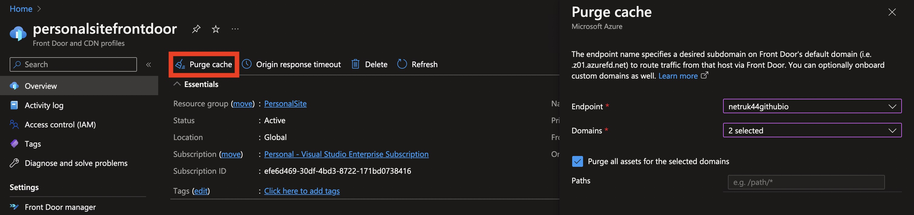
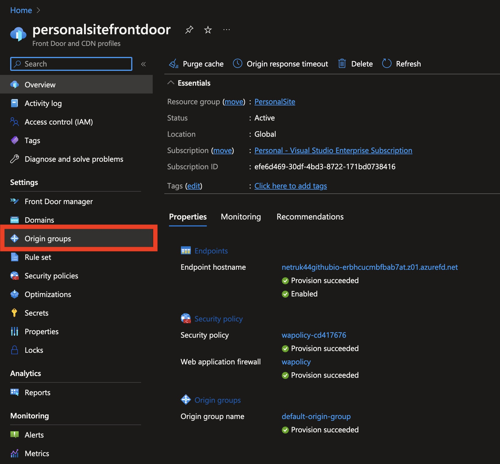
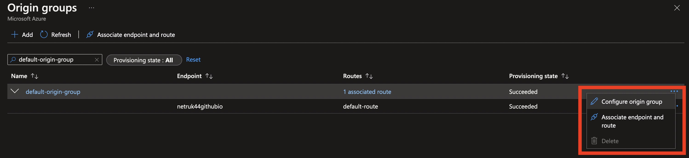
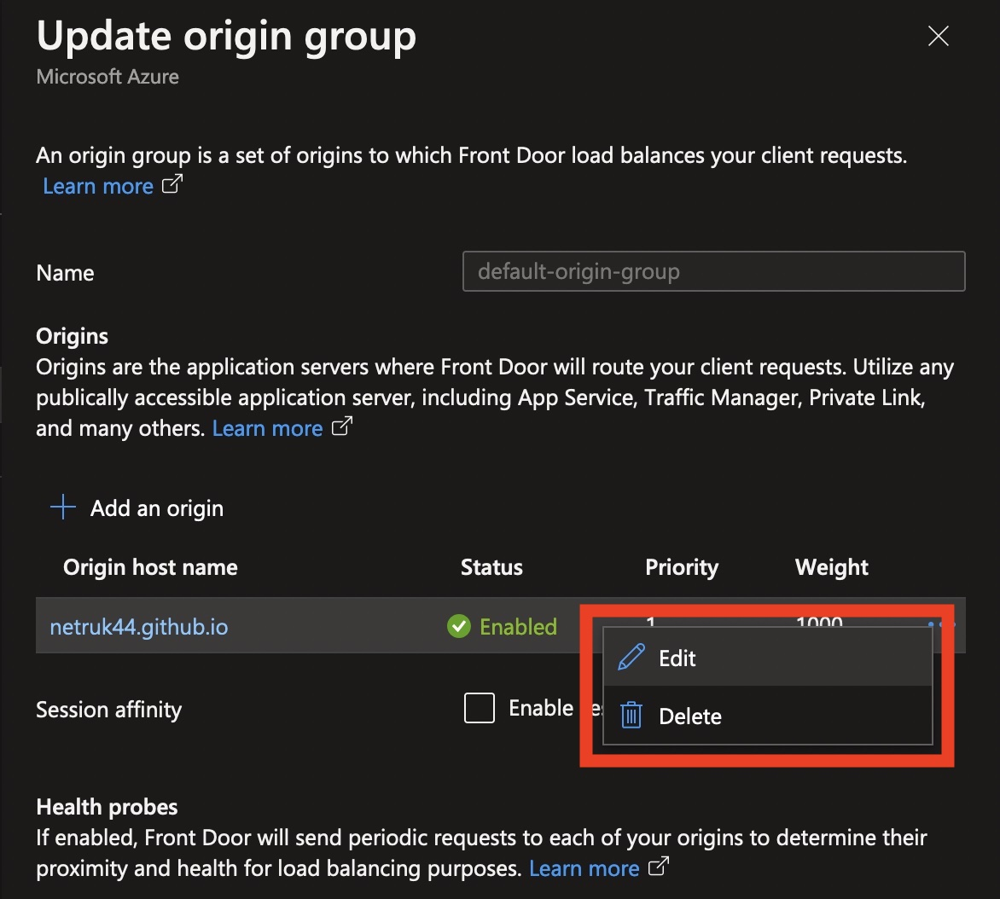
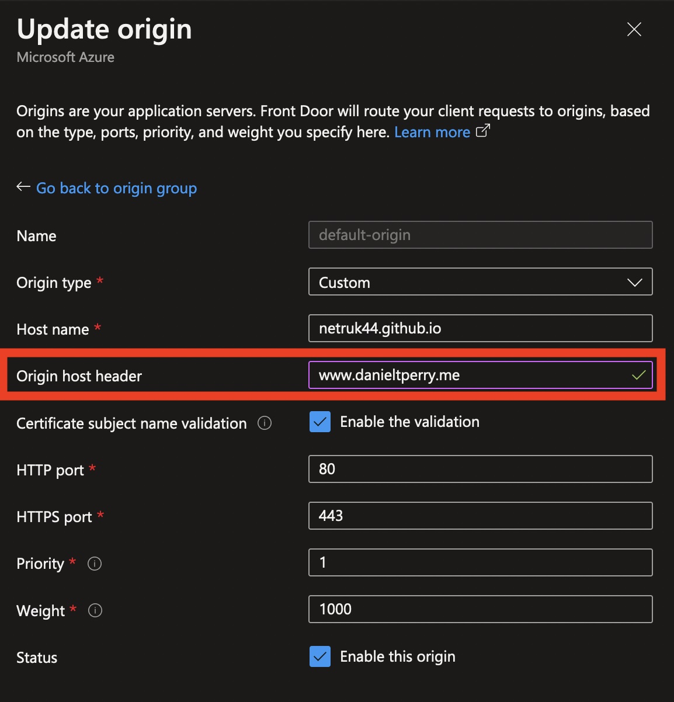
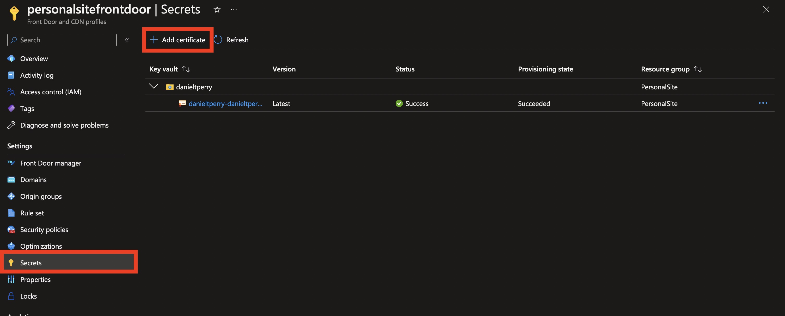
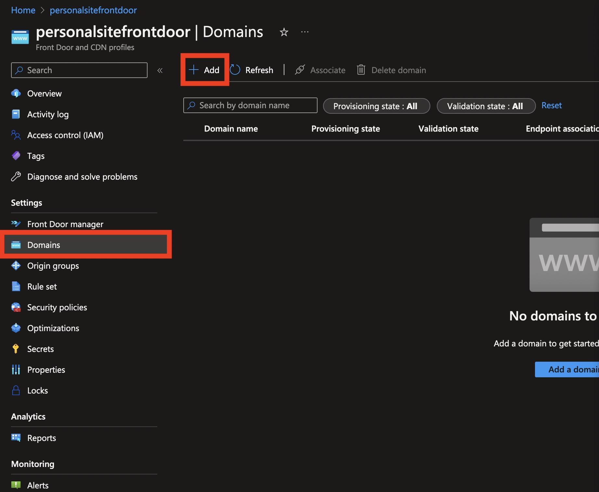
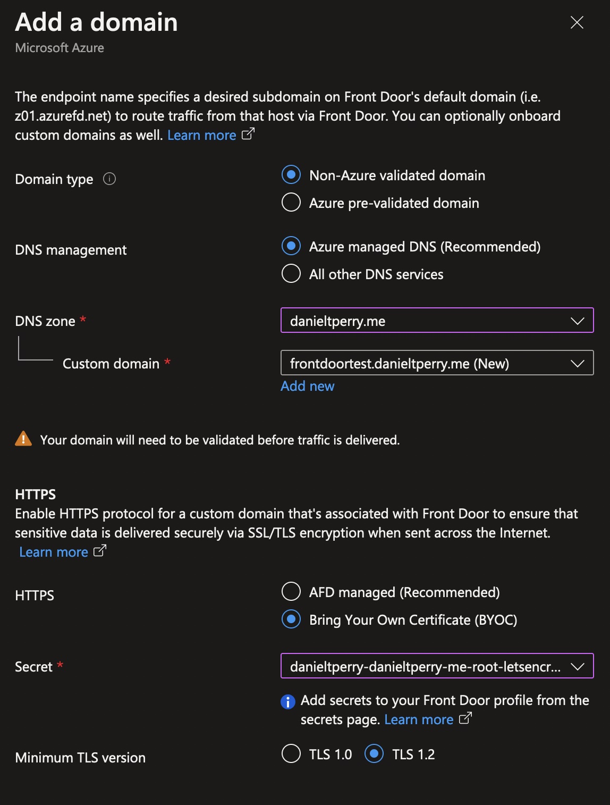
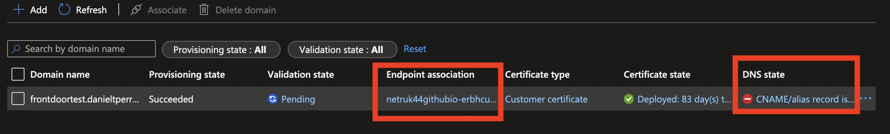
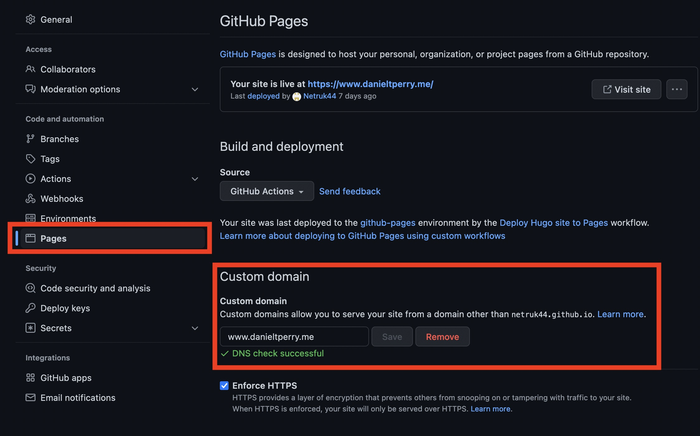

I was looking for some resources on the internet about how to set up an Azure CDN configuration for GitHub Pages while using a custom domain, and I couldn't find anything. I eventually managed to get everything working, so I decided to write it down in the hopes that maybe *someone* will find this interesting. To be completely honest, you're probably far better off using Cloudflare's CDN for free instead of paying for Azure's CDN. However, I have free monthly credits through an MSDN subscription, so I'm not directly paying for it anyway 😊.

> **Disclaimer**: I'm not a web dev. I barely know how the internet works. This shouldn't be construed as the "correct" way to set up a CDN. This is just what I've found through lots of stumbling around the Azure Portal. There's probably better advice somewhere out there, but I couldn't find anything.
>
> Also, this site is using Azure CDN Classic, not "Azure Front Door & CDN", which is apparently something new they've rolled out in the past year or so. I've tried to make sure everything works with this new flow, but if there's one thing I know about this kind of web development it's that nothing ever works like how you think it does. So take all of this with the **HUGE DISCLAIMER** that I am not actually using any of this 'in production', so I cannot claim that this definitely works. However, it should bring you at least 90% of the way there.

> **Edited on 12/6/22 to add**: I wanted to a message here to underline the fact that you definitely should not do this if cost is a concern for you. After running this setup described below for a month, the average daily cost was $1.15. That's About $420 per year to run the CDN for your site. The CDN Classic version of this same setup runs for less than a penny *a month*.
>
> I might someday rewrite this to be about CDN Classic instead, just because the cost savings is so dramatic, but I worry that anything written about a "classic" service is doomed to irrelevancy as Azure will inevitably shut down the classic version in favor of the non-classic CDN. I would wholeheartedly recommend reading through this entire post, and attempting to apply it to the CDN Classic instead of Azure's current offering, assuming it's still available by the time you're reading this.



## CDN Configuration

To get started with the CDN, you'll need to make a `Front Door and CDN Profile`. If you don't already have one of these (I didn't), you can use the "Quick create" option to configure a single CDN endpoint for your GitHub Pages website. If you *do* already have one of these, you're on your own 😊.

> **Note**: Azure moves things around *all the time*. By the time you're reading this, things might have changed from where they are in the screenshots below. I simply don't have manpower to keep this up to date with every change Azure does, so unfortunately you might have to figure out some things on your own if Azure changes them.

{}
*Creating the Azure Front Door*
{}

From here, you'll need to fill out information on your own. Pick your subscription, resource group, create a name for the resource, and choose a tier of service you'd like.

For the endpoint settings fill in the following:

* **Endpoint name**: Choose a name for the CDN endpoint. This can be whatever you like.
* **Origin type**: Choose "Custom", and for the host name, enter your GitHub Pages URL.
* **Caching**: Enable or disable based on your needs. My site is a simple HTML-only website, so I enabled caching with the option to ignore the query string.
* **Compression**: Enable or disable based on your needs. I chose to enable compression.
* **WAF Policy**: If you don't have one created already, create one here. The WAF policy controls access to the CDN through rule lists, and can be shared across CDN's to provide a common 'block rule list'.

{}
*Creating the Azure Front Door Profile*
{}

### Configure the Origin Host Header

Now that you have the CDN, you'll need to change some configuration in the endpoint for two reasons:

1. Once you setup your Pages site with a custom domain, GitHub will redirect *all* incoming requests to your `*.github.io` page to the domain you specify in the GitHub Pages configuration. All requests to your GitHub Pages site *must* come through the domain you've specified, or else you'll get a redirect.
2. Also by default, the Azure CDN will request the uncached page with the "Host" header the same as the "Origin host name" you've configured above. In other words, it'll request your `*.github.io` page, and get a redirect to your domain instead.

If you don't change the configuration, what will happen once you've set up your DNS to point to your CDN endpoint is you'll get stuck in an infinite redirect loop to your domain, as GitHub can't tell that's where the request is actually coming from.

> **Important Note**: If the infinite redirect issue happens to you, remember that the Azure CDN **will cache redirect responses**. This can be confusing to deal with, as you might have fixed the issue with your GitHub Pages, but the CDN will continue to respond with a redirect.
>
> To resolve the infinite redirect loop after it's occurred, you'll need to purge the CDN's cache in the Azure Portal. You can do that here:
> 

To prevent the infinite redirect loop, you'll need to set the `Origin Host Header` property on your origin group.

1. Open your `Front Door and CDN Profile` you made
2. Select `Origin groups` from the menu on the left.
  
3. *All the way* on the right, click the "..." for the `default-origin-group`, or whatever origin group references your Github Pages site, and select `Configure origin group`
  
4. In the `Update origin group` right-hand menu that pops up, select the "..." for your origin host, and select `Edit`
  
5. Update the `Origin host header` to your custom domain.
  

Now, when the CDN requests your site from GitHub Pages, it'll appear as if the request came from your domain.

### Certificate Setup

To get HTTPS for your CDN-backed site, you need your own certificate. If you don't have one, you can obtain one from Let's Encrypt for your domain for free. Without a certificate, the CDN **cannot** host your site over HTTPS, as Azure doesn't have a certificate that permits them to encrypt traffic for your site.

> **Note**: Azure Front Door/CDN can automatically create and manage a certificate for you. However, it will not do this for apex domains (i.e. `yourdomain.com`, with nothing in front), and personally I was unable to get it to generate a certificate for a `www.` subdomain either. However, if you want your site hosted on a different subdomain (like `blog.yourdomain.com`), this option may work for you.
>
> If this is the route you'd like to go, skip this certificate step, and in your custom domain setup (the next step), select `AFD managed` for the HTTPS section. I can't provide much guidance there, as I haven't tried it.

Once you have a certificate, you'll need to put it into an Azure Key Vault, you can either make a new one or use an existing one. Once your certificate is in a Key Vault, go to the `Secrets` section of your CDN and click "Add certificate". Locate your certificate in the right-hand side menu that pops up and click "Add".

### Custom Domain Setup

This is the step where you configure the CDN to allow requests for your domain.

Click `Domains` on the left, then `Add` at the top to get started.

Fill in the information on the right-hand menu that pops up:
1. I haven't pre-validated my domain, so I selected `Non-Azure validated domain`
2. If your domain's DNS is managed by Azure, select `Azure managed DNS`, otherwise select `All other DNS services`.
3. Fill in your domain information in the box provided.
4. Under HTTPS, select `Bring Your Own Certificate` and select the certificate you added above (or select `AFD managed` if you'd like to give that a try for a non-apex domain).

Click "Add" to add the domain. Then, configure the `Endpoint association` by selecting the endpoint and route that points to your GitHub Pages site.

Once the endpoint is configured, update your domain's DNS records to point at the CDN by following the instructions under the `DNS state` link. If you're using Azure DNS, this can be performed for you automatically by clicking a button. Otherwise, you'll need to manually create a `CNAME` record for your domain's DNS that points to your CDN endpoint.

> **Note**: Both items highlighted should have the red ⛔️ icon by default. However, in this screenshot I have already configured the endpoint association, which can't be changed it once it's set up.

Once you've configured the endpoint and updated your DNS, then click on the `🔄 Pending` link under `Validation State`, and fix up any remaining items (you'll need to prove you own the domain by creating a `TXT` record in your DNS).

Once these final steps are done, your CDN should be ready to be used! The last step is to configure your GitHub Pages to accept the custom domain (if you haven't done that already).

## GitHub Pages Configuration

There's nothing special involved here, just go to `Pages` on the left, then enter your custom domain. For this site, it's `www.danieltperry.me`.

> **Important Note**: Once you apply this custom domain, GitHub pages will begin redirecting **all** direct requests to your `*.github.io` page to the domain you've specified in this text box. This can result in downtime for your site if you haven't yet set up your domain's DNS.

> **Note**: GitHub might complain that your DNS is configured incorrectly. This did eventually resolve itself for me (as you can see in the screenshot), however the best test is to simply try navigating to your domain and seeing what happens.

And that's it! Your GitHub Pages site should now be served by Azure's CDN!

## Final Thoughts
This entire process feels way more complicated than it needs to be for this use-case. However, Azure CDN isn't exactly targeting developer personal websites as their primary customer base, so I can understand the complexity involved here. I only wish there was an easier way to do it all without going through dozens of hard-to-understand menus.

Hopefully you've managed to get your site working with CDN, because as I mentioned up front, I actually set this site up with Azure CDN Classic and not "Azure Front Door and CDN". I've actually never used any of this stuff I've just written about above for this site yet. All the steps I've written about above are mostly theoretical, with me applying my Classic CDN knowledge to this new UI.

I *believe* this all should result in a working CDN for your GitHub Pages site. I've tested what I've written here and it appears to all be working fine for the subdomain I tested it on (`frontdoortest.danieltperry.me`, which may or may not still exist by the time you're reading this).

However, I've hit edge cases in unexpected places many times before (such as the infinite redirect I mentioned above). There's always the chance I've neglected to mention something important, or there's some hidden edge case I haven't seen that you might hit.

If *you've* tried this, please do write me an e-mail saying that it does or doesn't work, I'd love to have some feedback 😊!

