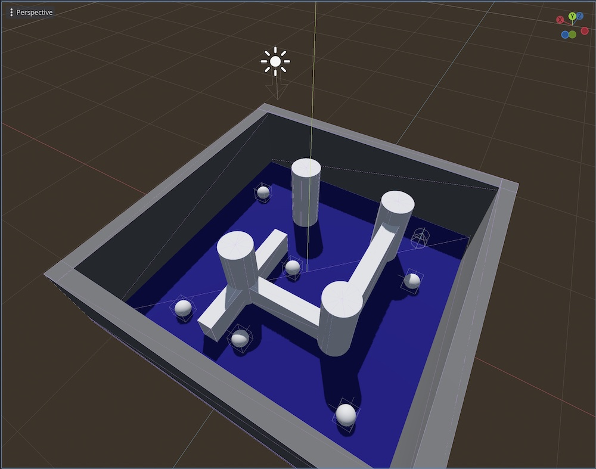
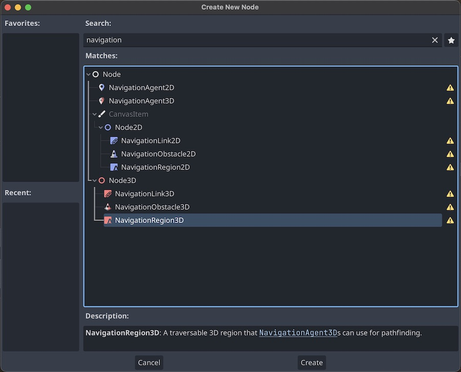
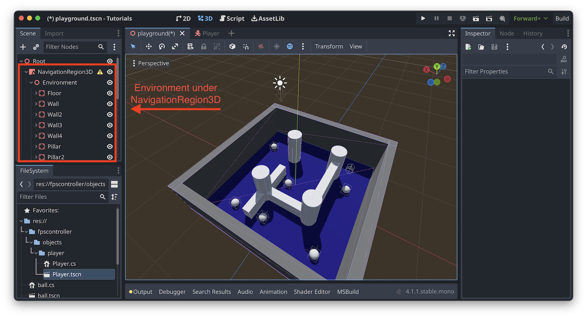

>**Godot Version**: 4.1.1 .NET  
>**Difficulty**: Intermediate  
>**GitHub Repository**: Completed tutorial [here](https://github.com/Netruk44/godot-tutorials/tree/navigation)

---

Godot has some pretty good built-in tools for pathfinding and navigation, but when getting set up I found that the Godot docs don't have a complete end-to-end example of getting everything setup. There's lots of separate tutorials that cover different parts of the process, and if you can follow them all you can get it working, but I wanted to put together a single tutorial that covers everything from start to finish.

Also pretty much every Godot tutorial out there that isn't the official Godot docs appears to be a YouTube video, which was frustrating to me as someone who prefers to read tutorials instead of watching them.

This tutorial will take you through the process of adding a NavMesh to a scene. Once the NavMesh is created, we'll add agents to the scene and have them pathfind around the NavMesh towards the player. We'll also add some obstacles to the scene and see how the agents react to them.

This tutorial will be using C# for the scripts, but GDScript should work just as well. This tutorial will also assume that you're familiar enough with Godot to know how to create a scene, how nodes work, and adding scripts to those nodes. If you're not familiar with Godot, I recommend checking out the [Godot Docs](https://docs.godotengine.org/en/stable/getting_started/step_by_step/index.html) and following their step-by-step tutorial and *"Your first 3D game"* tutorial.

This tutorial *will not* be an exhaustive guide to Godot's navigation tools, just a simple tutorial to help you get started. As always, if you want to know more, check out the [Godot Docs](https://docs.godotengine.org/en/stable/tutorials/navigation/index.html).

<!-- **Note**: We'll be starting off with the scene we made in the last tutorial I wrote, [Weeping Angel Effect in Godot Engine](../godot-weeping-angel-effect/). You don't need to understand how the effect works, but the map makes a nice area for agents to pathfind around in. You can find that in the `playground.tscn` file located in [this Github Repository](https://github.com/Netruk44/godot-tutorials/tree/weeping-angel). -->

## Creating the NavMesh

### Creating the Scene

Before we can have agents that pathfind around an area, we need some space for them to pathfind *in*.

Godot has some good whiteboxing tools to make a rough scene with. All we need for this tutorial is a room with some walls and a floor. It's best if the room you make is divided with walls into sections so that the agents can't always move directly towards their objective.

When making your scene, place all your scenery objects underneath a single Node3D. This will make it easier to add the NavMesh later.

For this tutorial, I'll be using the scene I made in my previous tutorial, [Weeping Angel Effect in Godot Engine](../godot-weeping-angel-effect/). You don't need to follow the tutorial, I'm only using the scene.


{}
*If you want to use my scene, you can find that in the `playground.tscn` file located in [this Github Repository](https://github.com/Netruk44/godot-tutorials/tree/weeping-angel).*
{}

Don't worry about the spheres in the image just yet, we'll get to that later. Those are going to become the agents that navigate around the scene.

Once your scene is completed drop in a player-controlled object so that you can move and look around the scene. I'll repeat what I wrote in the last tutorial:

> For a player-controlled object with built-in camera, I've found [FPSControllerMono](https://github.com/ismailgamedev/FPS-Controller-Mono) to be an okay starting point, but as of writing this the plugin has not yet been updated for Godot 4.0 and fails to compile cleanly, so you may need to make some fixes.

The FPSControllerMono isn't very difficult to make yourself by hand if you're experienced with Godot, but it helps to have a starting point. It's just a CharacterBody3D with a Camera and a CollisionShape, with a script to handle input and mouse looking.

### Creating the NavigationRegion

Once you have a scene ready, it's time to create the NavMesh. Start by adding a NavigationRegion3D node to the scene, and move the parent node of the scenery objects underneath it.




Then, with the NavigationRegion3D selected, in the right-hand sidebar under the `Inspector` tab, create a new NavigationMesh.


For the most part, the default settings are okay. The only thing you really need to make sure is correct is the setting under `Agents/Radius`. This is what tells Godot how large the agents navigating your scene are.

> **Important**: If you find that your agents are getting stuck on walls, or if the navmesh just isn't showing up in certain parts of the scene, adjust the agent radius setting and/or the `Cell Size` setting under `Cells/Size`. The smaller the cells, the more accurate the NavMesh will be, but the more expensive it will be to calculate.

Once you've set the radius, click the `Bake NavMesh` button at the top of your viewport. This will create the NavMesh, and you should see it appear in your scene as a bunch of cyan triangles floating above the ground.


We've got our NavMesh, now let's add some agents to navigate it.

## Adding Agents

### Setting up the target

Before we can pathfind anywhere we need to have a destination in mind. For this tutorial, we're going to be making the agents navigate towards the player all the time. To do this, the agents need to know which object is the one controlled by the player. And to do *that*, we'll be using groups.

> **Note**: Instead of using groups, you could just hardcode a path to the player node in the agent's script, but this is likely a bad idea. Things will break if you ever change the name of your player object, or fail to keep things consistent from scene to scene.
>
> Using groups allows the agents to not need to care about the layout of a scene in order to function.

In the right hand sidebar, click `Node`, then `Groups`, then finally `Manage Groups`.


In the `Manage Groups` menu, enter in a name for the group ("player" works fine) and click "Add". Then find the root node of the player in the middle column, then "Add >" to add the player node to the group.


Click "OK" to close the menu. You can verify that it worked if you see a new symbol on your player node in the scene tree.


### Preparing the Agent

Now we need to make a scene for the objects that will be moving around. Create a new scene with a `CharacterBody3D` as the root node. Give it a `CollisionShape` a `MeshInstance` and (most importantly) a `NavigationAgent3D`, and add a script to the root node.


Clear out any unnecessary code from the default script. Yours should look something like this:

```cs
using Godot;
using System;

public partial class agent : CharacterBody3D
{
	public const float Speed = 5.0f;

	// Get the gravity from the project settings to be synced with RigidBody nodes.
	public float gravity = ProjectSettings.GetSetting("physics/3d/default_gravity").AsSingle();

	public override void _Ready()
	{
	}

	public override void _PhysicsProcess(double delta)
	{
		Vector3 velocity = Velocity;

		// Add the gravity.
		if (!IsOnFloor())
			velocity.Y -= gravity * (float)delta;
        
		Velocity = velocity;
		MoveAndSlide();
	}
}
```

We'll need to retrieve a reference to the player node, as well as our local `NavigationAgent3D`. Create some members to hold the references, then retrieve them in the `_Ready` method.

```cs
public override void _Ready()
{
    // Get the navigation agent
    navigationAgent = GetNode<NavigationAgent3D>("NavigationAgent3D");

    // Get the player node
    var player_group = GetTree().GetNodesInGroup("player");

    if (player_group.Count > 0)
    {
        player = player_group[0] as Node3D;
    }
    else
    {
        GD.PrintErr("No player found!");
    }
}
```

> **Tip**: If you were to simply write `player = GetTree().GetNodesInGroup("player")[0];`, things would work just fine most of the time. However, use caution when doing this. If there is no player node in the scene, or if you accidentally typo the group name, Godot won't crash. A NullReferenceException will be quietly logged to the editor, but the game will continue to run.
>
> It can be confusing to figure out why your agents aren't navigating if you don't have an error message to tell you what's wrong.

Now let's get started with pathfinding.

### Code for pathfinding to the player

`NavigationAgent3D` needs to be told a destination before it can start performing pathfinding. For this tutorial, that'll be the player's position. And we'll need to set it more than once, since the player is going to be moving around the scene. But how often should we update the path?

The simplest way to do this is by just setting `navigationAgent.TargetPosition` to the player's transform every frame. That'll work, but it's not very efficient. For small scenes with small numbers of agents it's no problem, but it could have performance issues in a larger scene with many pathfinding agents.

Instead let's add a member to keep track of the last time we updated the target and only update it every so often. We'll also add a member to keep track of how often we want to update the target.

```cs
// How often to update the target (in seconds)
private const double TargetUpdateInterval = 0.5f;

// How long since we last updated the target
private double lastTargetUpdate = TargetUpdateInterval; // Start at the interval so we update immediately.
```

Then, in the `_PhysicsProcess` method, we'll update the target if it's been long enough since the last update.

```cs
public override void _PhysicsProcess(double delta)
{
    // Check if we should update the target
    lastTargetUpdate += delta;
    if (lastTargetUpdate >= TargetUpdateInterval)
    {
        lastTargetUpdate = 0.0;
        navigationAgent.TargetPosition = player.GlobalTransform.Origin;
    } 
```

> **Note**: You may notice sometimes with this approach that the agents will stop short of the player. This is because they're hitting the position the player *was* at when we updated the target, but they've moved since then.
>
> If you were using this logic for a real game, you might consider dynamically adjusting the target update interval based on the distance to the player. This is left as an excerise for the reader 😊.

Now that we've set a destination and a path, we need to start moving along it. `NavigationAgent3D` provides a helper method for us: `GetNextPathPosition()`. This returns the next point in the path to the target in world space. We'll use this to move towards the target.

> **Note**: It's okay to call `GetNextPathPosition` on every physics frame, in fact the `NavigationAgent3D` expects/requires it to be called that often.

```cs
    Vector3 nextPathPosition = navigationAgent.GetNextPathPosition();
    Vector3 velocity = Velocity;

    // Add the gravity.
    if (!IsOnFloor())
        velocity.Y -= gravity * (float)delta;

    // Move towards the next point in the path.
    Vector2 direction = new Vector2(nextPathPosition.X, nextPathPosition.Z) - new Vector2(GlobalTransform.Origin.X, GlobalTransform.Origin.Z);
    direction = direction.Normalized();

    velocity.X = direction.X * Speed;
    velocity.Z = direction.Y * Speed;

    Velocity = velocity;
    MoveAndSlide();
```

And if you *just* want pathfinding, you're done! You can now add as many agents as you want to your scene and they'll all pathfind towards the player.

Let's see it in action:



But notice how the agents kind of clump together when they all have the same target? That's not very interesting to look at. How can we make them spread out?

## Avoidance

You can think of avoidance as a kind of 'layer' above the normal pathfinding. Adding avoidance to an agent doesn't change its path, only how it moves along that path. We'll use this to make the agents avoid each other while they're moving towards the player. It'll also allow us to make areas where the agents won't go, which can be used for your own custom gameplay mechanics.

Avoidance works by giving the `NavigationAgent3D` a little more control over the agent's velocity. Instead of setting `Velocity` directly, we'll tell the agent the direction we want it to move, then it'll tell *us* what our velocity should be so that we don't collide with obstacles.

### Avoiding other agents

Go back to your agent scene and select the `NavigationAgent3D` node. In the right-hand sidebar, back under the `Inspector` tab, unfold the `Avoidance` section and check `Avoidance Enabled`.


The `Radius` setting here is separate from the one we set on the `NavigationMesh` earlier. This radius doesn't affect pathfinding in any way whatsoever. This is only used to figure out how quickly other agents should move away *from us*. If you increase this, the agents will spread out more, but they'll also generally move more slowly as they have to work around each other.

Another important option on this menu is `Max Speed`. This is the maximum speed that the agent will move at. Even if you set `Speed` in your agent's script to be higher than this, the agent will never move faster than this speed. In effect, you now have *two* places you need to manage this agent's speed. This can be confusing, so I recommend setting `Max Speed` to be the same as `Speed` in your agent's script, or finding some other way to keep them in sync.

The other settings in this menu are outside the scope of this tutorial, but feel free to play around with them and see what they do. There are tooltip descriptions on the labels which are pretty helpful for figuring out what they control.

> **Important**: Make sure that `Avoidance Layers` has at least one layer checked, and also make sure `Avoidance Mask` has that same layer checked. This is what tells the agents to avoid each other.

Now let's update our code to have `NavigationAgent3D` provide our velocity. Remove the following in `_PhysicsProcess`:

```cs
    Velocity = velocity;
    MoveAndSlide();
```

And replace it with this:

```cs
    navigationAgent.Velocity = velocity;
```

That'll start the async process of calculating the agent's proper velocity to avoid obstacles. Once it's done, it'll emit an event that we can listen to. Add the following to the `_Ready` method:

```cs
    navigationAgent.VelocityComputed += OnVelocityComputed;
```

And implement the `OnVelocityComputed` method:

```cs
public void OnVelocityComputed(Vector3 safeVelocity)
{
    Velocity = safeVelocity;
    MoveAndSlide();
}
```

And that's it! Now the agents will avoid each other while they're moving towards the player. For this video I've increased the radius to be larger than the object just to make the avoidance more obvious.



### Avoiding obstacles

Avoiding obstacles is very similar to avoiding other agents. The only difference is that we need to add a `NavigationObstacle3D` node to the scene. The `NavigationAgent3D` will automatically avoid any `NavigationObstacle3D` nodes in the scene (so long as the layers and masks are set correctly).

In your scene add a `NavigationObstacle3D` node and place it somewhere in the scene. The way you configure it is somewhat convoluted, however.


There are two different kind of obstacles, dynamic and static. If you set the `Radius` property, then the obstacle is dynamic. If you set the `Vertices` property, then the obstacle is static. It's possible to set both, but make sure you read the [Godot Docs](https://docs.godotengine.org/en/stable/tutorials/navigation/navigation_using_navigationobstacles.html) to understand how that works.

For this tutorial, I'm just going to set a radius, even though I won't be moving the obstacle around dynamically. Feel free to use the same avoidance layer as the agents (layer 1 by default), or if you would like to use a different one make sure to update the avoidance mask on the agents.

> **Note**: If it looks like the agents aren't avoiding the obstacle, try increasing the `Height` setting, or moving the obstacle up so that the center of the obstacle is roughly the same height as the centerpoint of your agents.


> **Note**: As of Godot version 4.1.1, you can't actually use the transform gizmo to move the obstacle around the XZ plane. If you try, it'll start creating points for a static obstacle instead.
>
> As a workaround, you can manually modify the node's transform in the inspector.

Now if you run the scene, you should see the agents avoid the obstacle as well as each other.



## Debugging

If you're having trouble getting your agents to navigate the way you'd like them to, Godot provides a way for you to see the navmesh, obstacles, and collision shapes while running the game. In the topbar menu, under "Debug" there are options for visualizations:


{}
*There's also an option for visible paths, but I haven't gotten that to work yet.*
{}

Enable these options, and now you can see them while the game is running:


## Conclusion

And there you have it, a complete end-to-end example for setting up navigation in Godot. I hope this tutorial was helpful to you! Navigation is a complex topic, and this is only a simple example. If you want to know more, as always, check out the [Godot Docs](https://docs.godotengine.org/en/stable/tutorials/navigation/index.html). They go far more in-depth than I have here, and less like to be out of date than this tutorial 😊.

