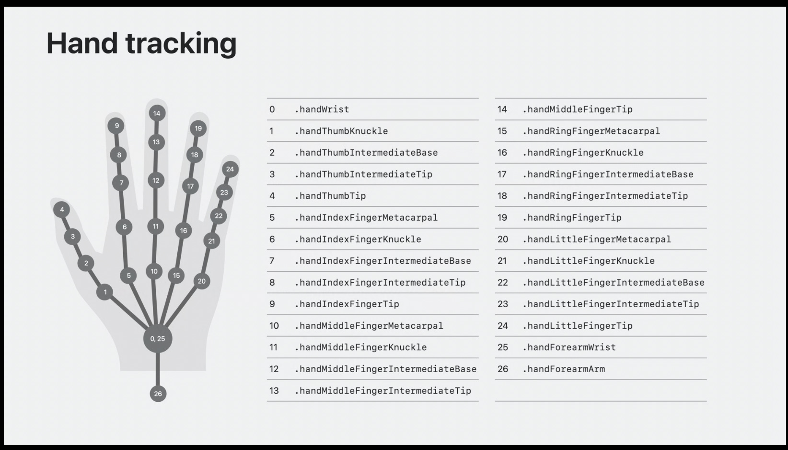
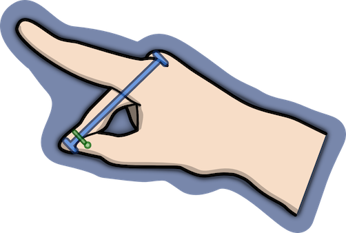
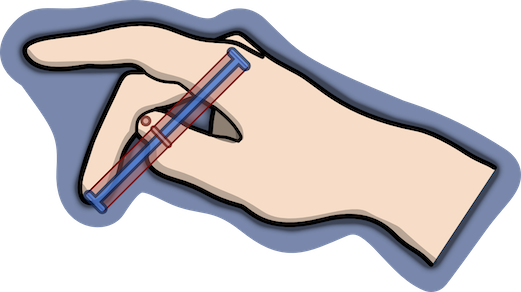

<!-- Image / Video header image -->
<!-- Idea: Image of debug visualization of finger drag -->
<!-- Idea: Video of finger drag in action -->

{}
*Debug view of the finger drag implementation*
{}

>**visionOS Version**: 2.2  
>**Difficulty**: Intermediate  
>**Related Projects**: [Spatial Physics Playground](/project/2024-physics-playground/)



---


{}

## Introduction

* What is the goal of this post?
  * Implement custom hand gestures for Apple Vision
  * Use the gestures to control some kind of 'toy' in the Spatial Physics Playground app
* Prompt: How do you implement meaningful custom hand gestures for Apple Vision?
  * The idea needs to be simple enough for a first attempt at integrating hand gestures.

### Spatial Physics Playground

<!-- TODO: Image of the app in action -->

* Introduce Spatial Physics Playground
  * What is the app?
  * What are 'toys' in the app?
* Idea for SPP: Add a Thruster that can be attached to other objects which integrates hand gestures.

### The Thruster Toy

<!-- TODO: Image of thruster attached to another object -->

* What is the Thruster?
  * Basically stolen from Garry's Mod.
  * A simple object that can be attached to other objects in the app.
  * When activated, it applies a force to the object it is attached to.
  * The specifics of the truster implementation aren't important for this post.
  * Many things are going to be glossed over in favor of making a more clear tutorial.

### Hand Gesture Idea

* Remember, it needs to be simple to implement.
* It also needs to complement the system-wide user interface.
* The index finger is taken over by the system for most gestures.
* How about a middle finger tap and drag gesture?
  * Tap to toggle the thruster on and off.
  * Drag to control the thruster's strength.
* Let's do it!

## Planning

### What's Provided by ARKit?


{}
Image courtesy of [Substack - Stuart Varrall](https://varrall.substack.com/p/hand-tracking-in-visionos)
{}

* Let's first look at what data is provided by ARKit.
* Using the above image, you can see that we're provided with a lot of joints for each hand.
* Each joint has a position and rotation that we can use to implement our hand gestures.
* We're going to focus on the thumb and middle finger joints for this gesture.
  * Specifically `.handThumbTip` (number `04`), `.handMiddleFingerTip` (number `14`), and `.handMiddleFingerKnuckle` (number `11`).


### The Idea


* The plan: project the thumb tip onto an imaginary line that extends from the middle finger tip to the middle finger knuckle.
  * Then we can see how far away the thumb is from this line.
  * If the thumb is close enough to the line, we can consider it to be 'touching' the middle finger.
  * At that point, we can see if the thumb starts to move up or down the middle finger (drag), or if it moves away without moving up or down (tap).
* For simplicity, it'll just be a single line, even though most people bend their fingers a little bit naturally.
* Further refinements could break it down further into two or even three line segments that get tracked.
  * Two segments: Middle finger tip -> middle finger intermediate base -> middle finger knuckle
  * Three segments: Middle finger tip -> middle finger intermediate tip -> middle finger intermediate base -> middle finger knuckle
* This is where Linear Algebra comes in.
  * Given a point and a line, projection provides us with the closest point on that line to that point.
    * (No, this isn't the real, formal definition of projection. That would be getting too much into the weeds of math, and we're trying to keep this simple.)
  * Seems relevant to our problem, we need to know if the thumb is touching this imaginary line, and to do that we need to know the closest point on the line to the thumb.
  * The projection formula will also give us a number we can use to see if the thumb is moving up or down the line as well. Useful for a drag gesture!
* Well, we can't put it off any longer. It's time to talk about math.


### Background Math - The Line Projection Formula
* > This section is tongue-in-cheek, and is going to be a whirlwind tour of deriving a formula. I'm definitely not the best person to be teaching math concepts, so unfortunately there will be a lot of detail-skipping involved.
* > Don't worry if a lot of this goes over your head. This section is here to explain the logic behind the math we're about to implement. I'll explain the details we need in more detail next.
* [Wikipedia](https://en.wikipedia.org/wiki/Projection_%28linear_algebra%29#Formulas) tells us all we need to know about projection. Give it a glance, and tell me that it isn't simplicity itself.
* ...
* What do you mean you don't understand? It's right there, clear as day:
  * \( P_A = \sum_i \langle \mathbf u_i, \cdot \rangle \mathbf u_i \)
  * In this formula:
    * \( P_A \) is "the projection onto subspace A"
    * \( \sum_i \) is a sum (using the placeholder variable \( _i \)). You figure out all the terms of the sum, then add them together. A single term is defined by what's after the \( \sum_i \) symbol, and you replace all placeholder \( _i \) after the \( \sum_i \) with 0, 1, 2 ... up to the number of terms you have.
    * \( \langle x , y \rangle \) is an inner product. It's essentially a way to compare two things (vectors, in this case) to see how much they "point in the same direction".
    * \( \mathbf{u} \) (without the \( _i \)) defines the basis of the space we're projecting onto. Depending on the number of dimensions of the space you're projecting onto, this could be 1 to n (orthogonal!) vectors.
      * (The basis of our space will be the 1-dimensional line from the user's middle finger tip to their middle finger knuckle.)
    * So then, it follows that \( \mathbf{u}_i \) is the basis vector for a single dimension of the space.
    * Finally, the \( \cdot \) inside the angled brackets is a placeholder for the vector we're projecting.
    * Also, keep in mind that multiplication is usually not written out like \( x*y \) or similar. It's just implied when you have two things next to each other.
  * (Collapse: "But there's a simpler formula!")
    * Yes, I can see that formula for projecting onto a line:
      * \( P_\mathbf{u} = \mathbf u \mathbf u^\mathsf{T} \)
    * Both of these are correct. 
    * The one I'm using is generalized and will lead us to something we're looking for.
    * Whereas this specialized formula doesn't do that. So...I'm not going to explain it.
    * Being good at math is recognizing which formulas to apply and when. Some lead you to a more helpful place, others don't.
  * Let's rewrite this formula just a little bit so we can introduce \( \mathbf{v} \), the vector we're going to project, as well as \( \mathbf{d} \), the number of dimensions of the space we're projecting onto (both of which are already in the formula implicitly, we're just going to make them explicit):
  * \( P_A(\mathbf{v}) = \sum_{i=1}^{d} \langle \mathbf{u}_i, \mathbf{v} \rangle \mathbf{u}_i \)
  * This is the exact same formula, just rewritten for clarity.
  * Let's start massaging this formula to suit our specific needs.
  * Now, obviously since we're projecting onto a one-dimensional line, d = 1:
  * \( P_A(\mathbf{v}) = \sum_{i=1}^{1} \langle \mathbf{u}_i, \mathbf{v} \rangle \mathbf{u}_i \)
  * A sum from i = 1 to 1 is just one term, so let's simplify:
  * \(  P_A(\mathbf{v}) = \langle \mathbf{u}_1, \mathbf{v} \rangle \mathbf{u}_1 \)
  * We can rename \( \mathbf{u}_1 \) to just \( \mathbf{u} \) now as we only have the one basis vector (the line we're projecting onto):
  * \( P_A(\mathbf{v}) = \langle \mathbf{u}, \mathbf{v} \rangle \mathbf{u} \)
  * By default it's assumed that basis vectors are normalized, but we may not be working with a normalized basis vector (most people's fingers aren't exactly 1 meter long). It's not harmful to normalize an already-normalized vector, so let's normalize. Divide by the length of the basis vector (\(\mathbf{u} \cdot \mathbf{u}\)):
  * \( P_A(\mathbf{v}) = \frac{\langle \mathbf{u}, \mathbf{v} \rangle \mathbf{u}}{\mathbf{u} \cdot \mathbf{u}} \)
  * Let's re-order this a little bit. Remembering our elementary math classes, multiplication and division are associative. In other words, \( \frac{xy}{z} \) is equal to \( \frac{x}{z}y \):
  * \( P_A(\mathbf{v}) = \frac{\langle \mathbf{u}, \mathbf{v} \rangle}{\mathbf{u} \cdot \mathbf{u}} \mathbf{u} \)
  * And, continuing to remember our math classes, we know we can replace the inner product with a dot product (since we're dealing with vectors and not, say functions or complex numbers):
  * \( P_A(\mathbf{v}) = \frac{\mathbf{u} \cdot \mathbf{v}}{\mathbf{u} \cdot \mathbf{u}} \mathbf{u} \)
* **There we have it, the projection formula for projecting a point `v` onto a one-dimensional space `A` defined by a potentially un-normalized vector `u`.**
* This is the standard formula you'll see if you look up how to project a point onto a line orthogonally. We just derived it ourself.
* Wikipedia couldn't have made it any simpler for us.
* ...
* What do you mean you still don't understand?
  * You know how to do a dot product, right?
* Alright, fine. I guess I can explain a *little* bit more.

### Background Math - Dot Products
* What is a dot product?
  * A dot product is a way of multiplying two vectors together to get a scalar value.
    * (A scalar value is just a single number, not a vector.)
  * The dot product of two vectors is the sum of the products of their corresponding components.
  * So, for example, the dot product of two 3D vectors is:
  * \( \mathbf{u} \cdot \mathbf{v} = u_1 v_1 + u_2 v_2 + u_3 v_3 \)
  * Or, in code: `(u.x * v.x) + (u.y * v.y) + (u.z * v.z)`
* Dot products have many, many uses and are well worth familiarizing yourself with, if you haven't already.
* This post won't dive into how to use dot products (remember them if you need to know the angle between two vectors!), but they'll be a part of our implementation.

### Background Math - How to Implement Tap Gesture?
* Okay, so we have the thumb's position projected onto the line. What now?
* Now we need to know whether the thumb is touching the line.
* That sounds like a distance calculation to me.
* While the thumb remains within a certain radius of the projected point on the line, the thumb is considered to be 'touching' the middle finger
  * We don't know how thick the user's middle finger is, so we need to pick a reasonable threshold. Likely through testing out the gesture to see what feels best.
  * Keep in mind that since we're only using a single line segment that goes from finger tip directly to the knuckle, and most people are naturally going to bend their fingers a little bit, the imaginary line is likely going to mostly go through the air in front of the user's middle finger.
  * So the threshold should be large enough so that the thumb can't accidentally go 'through' this line too far and exit out the back.
  * 

### Background Math - How to Implement Drag Gesture?
* Let's take a closer look at the projection formula and try to break it down a little bit:
* This is the formula we derived earlier:
* \( P_A(\mathbf{v}) = \frac{\mathbf{u} \cdot \mathbf{v}}{\mathbf{u} \cdot \mathbf{u}} \mathbf{u} \)
* To me this looks like *"something"* (\( \frac{\mathbf{u} \cdot \mathbf{v}}{\mathbf{u} \cdot \mathbf{u}} \)) multiplied by the line we're interested in (\( u \)). What is this *"something"*?
* Using the previous section, we can tell that it's a dot product divided by another dot product.
* We know that dot products result in scalar values, which means this whole *"something"* is itself a scalar (again, that it's just a number and not a vector)
* If we know that this *"something"* is a scalar, and we're multiplying it by the line (a vector), then the result has to be a point somewhere along that line.
* So then this *"something"* must be the component that tells us how far along the line the projected point is.
* Let's call it \( \mathbf{t} \):
  * \( t = \frac{\mathbf{u} \cdot \mathbf{v}}{\mathbf{u} \cdot \mathbf{u}} \)
* **`t` is the component that tells us how far along the line `u` the projected point `v` is.**
* If we track this over time, we can tell if the thumb is moving up or down the line.
  * In other words, tracking t over time is how we'll implement the 'drag' gesture.
* We've found our drag implementation!

### Combining Tap and Drag Gesture Recognition
* At this point you might think we're ready to dive into implementing things, but hold on.
* We need to consider what happens when we combine the availability of both gestures.
* We know when the user has begun to touch their thumb to their middle finger, but we don't exactly know which gesture they're about to perform.
* People aren't machines, and the hand tracking isn't perfect, so our code is always going to see some slight up and down movement as the user moves their fingers, even as they're attempting to perform a tap gesture.
* There needs to be some minimum threshold for movement up and down the line before we consider the action a drag gesture.
  * Again, discovered through testing.
* It also helps to consider how long the user has been touching their thumb to their middle finger when determining the gesture.
  * If the touch time is longer than a second, it's unlikely the user is attempting a tap gesture.
  * Likewise, if we detect a large drag in less than a quarter of a second, it's unlikely the user meant to perform a drag gesture.
* We'll need to consider these factors when implementing the gesture recognition system.

## Implementation

> ⚠️ **Important Note**
> 
> This post was written when visionOS 2.2 was the latest version.
> 
> If you're reading this in the future, some of this code may be outdated.

I'm going to move quickly through the Apple-specific WhateverKit-interfacing code for a couple reasons. First, I'm not writing extensive documentation for Apple for free. And second, Apple-specific code ages like milk (it becomes quickly outdated), so some of these sections are just going to be a quick reference without much explanation.

If you haven't already browsed through Apple's documentation for [Tracking and Visualizing Hand Movement](https://developer.apple.com/documentation/visionos/tracking-and-visualizing-hand-movement), I would recommend you do so first. It'll make understanding this code much easier.

Hopefully Apple hasn't changed the link by the time you're reading this, but if they have feel free to e-mail me and I can update it:



### App Setup

* Apps on Apple Vision work the same as apps for other Apple platforms.
* But to get to the interesting data, there's some limitations that we'll have to work around.
* For example, certain data can only be obtained under certain circumstances.
  * Specifically, certain data providers (like the hand tracking provider) can only be run inside immersive spaces (where your app is the only one visible to the user).
* Inside your app's `body`, you'll have to create an `ImmersiveSpace`, and a `View` to put inside it.

```swift
@main
struct MyCoolApp : App {
  @state private var viewModel = ViewModel()
  @state private var handTrackingModel = HandTrackingModel()

  var body: some Scene {
    WindowGroup {
      DefaultView()
        .environment(viewModel)
    }

    ImmersiveSpace {
      ImmersiveView()
        .environment(handTrackingModel)
    }
  }
}
```

### Hand Tracking Provider Setup

* Let's set up the data provider, which provides us data...about the transforms of the user's hand joints.
* Inside your immersive view, or perhaps inside a `HandTrackingModel` struct, create an `ARKitSession` and `HandTrackingProvider`

```swift
@Observable
class HandTrackingModel {
  let arSession = ARKitSession()
  let handTracking = HandTrackingProvider()
}
```

* When the user enters the immersive view, request authorization for hand tracking and start the hand tracking provider.

```swift
struct ImmersiveView : View {
  @Environment var handTrackingModel: HandTrackingModel

  var body: some View {
    // ...
  }.task {
    do {
      var dataProviders: [DataProvider] = [] // Required providers

      if await handTrackingModel.handTrackingIsAuthorized() {
        dataProviders.append(handTrackingModel.handTracking)
      } else {
        // Handle not having hand tracking available
      }

      try await arSession.run(dataProviders: dataProviders)
    } catch {
      // Handle error
    }
  }
  .task {
    await handTrackingModel.processHandTrackingUpdates()
  }
}
```

```swift
class HandTrackingModel {
// ...
    func handTrackingIsAuthorized() async -> Bool{
      // You may want to call this function *before* the ImmersiveView is shown,
      // if you'd like to control when the user is asked for permissions.
      return await arSession.requestAuthorization(for: HandTrackingProvider.requiredAuthorizations).allSatisfy{ authorization in authorization.value == .allowed }
    }
/// ...
}
```

* Remember to add `NSHandsTrackingUsageDescription` to your app's `Info.plist` file. Otherwise, your app will crash when you call `requestAuthorization`.

```xml
<key>NSHandsTrackingUsageDescription</key>
<string>A short description explaining why your app needs this permission.</string>
```

### Handling Updates and Storing State

* Let's store the latest state of the user's hands in some variables.
* First, let's define a struct to store this state.

```swift
struct HandsStatus {
    var left: HandAnchor?
    var right: HandAnchor?
    
    // Useful utility function:
    func forChirality(_ chirality: HandAnchor.Chirality) -> HandAnchor? {
        if chirality == .left {
            left
        } else {
            right
        }
    }
}
```

* Let's store the latest hand state in a global that can be accessed by the System we'll define later.

```swift
// In global scope
var latestHandTracking = HandsStatus()
```

* I dislike using global variables, but it's what I did in Spatial Physics Playground (which was based off some Apple documentation sample code).
  * I haven't yet found a way to avoid it, either, as there doesn't seem to be any mechanism to transfer external data into a System.
  * Refactoring out the global is left as an exercise for the reader.
    * And my future self 😊.
* Now let's update the `HandTrackingModel` to store the latest hand state.

```swift
class HandTrackingModel {
  // ...
  func processHandTrackingUpdates() async {
    for await update in handTrackingProvider.anchorUpdates {
      switch update.event{
      case .updated:
        let anchor = update.anchor
        
        if anchor.isTracked {
          // Update the appropriate hand info
          if anchor.chirality == .left {
            latestHandTracking.left = anchor
          } else if anchor.chirality == .right {
            latestHandTracking.right = anchor
          }
        } else {
          // Anchor has been lost, set hand tracking to nil.
          if anchor.chirality == .left {
            latestHandTracking.left = nil
          } else {
            latestHandTracking.right = nil
          }
        }
          
      default:
        break
      }
    }
  }
  // ...
}
```

### Setting up a System

* Remember to read [Apple's documentation](https://developer.apple.com/documentation/realitykit/implementing-systems-for-entities-in-a-scene) about implementing RealityKit Systems, if you haven't already.
* We'll need a System that's responsible for doing things based on the user's current hand state.
* The system will need to determine (and store) 
  * The current/previous t values
  * Whether the thumb is/was touching the imaginary line
  * etc.
* Then use the stored information to affect the simulation
  * Updates the thruster strength based on the t value.
  * Toggles the thruster on and off based on the tap gesture.
* Let's define a stub System for now to get us started.

```swift
class ThrusterSystem : System {
  required init(scene: Scene) { }

  func update(context: SceneUpdateContext) {
    // TODO: This.
  }
}
```

* Systems search through entities within a scene by using Components primarily (well, my Systems do), so let's make a Thruster Component.

```swift
struct ThrusterComponent : Component {
  var enabled: Bool
  var strength: Float
}
```

* This is enough to let us toggle the thruster and adjust its strength at runtime.
* We'll need to remember to add this component to the Entity when the user creates a Thruster in the app.
  * But that's for me to worry about, not you.
* We're also going to need a structure to hold the thumb's state inside the `ThrusterSystem`.
  
```swift

class ThrusterSystem : System {
  // ...
  struct ThumbStatus {
    // t-value tracking
    var currentT: Float = 0.0
    var previousT: Float = 0.0
    var totalTChange: Float = 0.0 // Increases as the user moves their thumb either up or down the line

    var contactTime: Float = -1.0
    var justReleased: Bool = false

    // BLOG POST TODO: Remove references to thumbMoved
    //var thumbMoved: Bool { totalTChange > 0.1 } // If true: User is performing a drag gesture

    var isDrag: Bool { totalTChange > 0.1 } // If true: User is performing a drag gesture
    var isTap: Bool { !isDrag && contactTime > 0.05 && contactTime < 0.5 } // If true: User is performing a tap gesture
  }

  // BLOG POST TODO: Rename to handStatus after all the code is in the post.
  private var thumbStatus: [HandAnchor.Chirality: ThumbStatus] = [
    .left: ThumbStatus(),
    .right: ThumbStatus()
  ]
}
```

* Let's work on implementing that `update` function!

### Implementing the System Update Function

* The update function will need to be broken up into two sections.
  * First, for each hand, we need to process the joint data and determine the thumb's position on the imaginary line, and if it's moved up or down.
  * Second, we need to update `ThrusterComponent` state based on the thumb state, then apply thruster forces to the entity.
* Let's write that out.

```swift

class ThrusterSystem : System {
  // ...
  func update(context: SceneUpdateContext) {
    // Part 1 - Update thumb contacts
    let deltaTime = Float(context.deltaTime)
    let handTrackingAvailable = latestHandTracking.left != nil || latestHandTracking.right != nil
    let isTapping: Bool
    let strengthChange: Float

    if handTrackingAvailable {
      // We'll implement these 3 functions in a later section.
      self.updateThumbContacts(deltaTime: deltaTime)
      isTapping = self.determineTap()
      strengthChange = self.determineDrag() * 10.0 // Scale by 10 to make the drag more sensitive
    } else {
      resetThumbContact(.left)
      resetThumbContact(.right)
      isTapping = false
      strengthChange = 0.0
    }

    // Part 2 - Update thruster components
    let query = EntityQuery(where: .has(ThrusterComponent.self))
    for thruster in context.entities(matching: query, updatingSystemWhen: .rendering) {
      if isTapping {
        let isNowEnabled = !thruster.components[ThrusterComponent.self]?.enabled ?? false
        thruster.components[ThrusterComponent.self]?.enabled = isNowEnabled
      }

      if abs(strengthChange) > 0.0 {
        let currentStrength = thruster.components[ThrusterComponent.self]?.strength ?? 0.0
        let finalStrength = max(0.0, currentStrength + strengthChange)
        thruster.components[ThrusterComponent.self]?.strength = finalStrength
      }

      // Apply forces, etc.
    }
  }
}
```
* This should be mostly self-explanitory except for the functions we'll implement later and `resetThumbContact`.
* Let's explain `resetThumbContact`:
  * The way this will work is, once the user lets go of their middle finger, `resetThumbContact` will be called, which will set the `justReleased` flag to true while maintaining the current state.
  * The frame afterward, we'll check this flag to toggle the thruster on or off.
  * At which point, `resetThumbContact` will be called again to actually reset the thumb state.
  * This way we can handle hand tracking being lost by going through this same process.
* Here's the implementation:

```swift
class ThrusterSystem : System {
  // ...
  func resetThumbContact(_ chirality: HandAnchor.Chirality) {
    // If justReleased is set, then this is the second pass, so actually reset the state.
    if self.thumbStatus[chirality]?.justReleased ?? false {
      // Was just released, now no longer justReleased
      self.thumbStatus[chirality]?.justReleased = false
      
      // Clear state
      self.thumbStatus[chirality]?.contactTime = -1.0
      // etc.
    } else if self.thumbStatus[chirality]!.contactTime > 0.0 {
      // Check contactTime to make sure we don't get phantom quick taps.

      // justReleased hasn't been set yet, so set it.
      self.thumbStatus[chirality]!.justReleased = true
      // Preserve state so that other functions can use it until next frame.
    }
  }
}
```

### Implement updateThumbContacts

#### Obtaining Joint Positions

* Explain how the final column of a transform matrix is the position.

#### Calculating Local Coordinates

* Explain how we can't use the world coordinates directly, and need to calculate local coordinates.

```swift
// Get the positions of the joints (in world coordinates)
let thumbPosition = thumbTip.anchorFromJointTransform.columns.3[SIMD3(0, 1, 2)]
let middleFingerTipPosition = middleFingerTip.anchorFromJointTransform.columns.3[SIMD3(0, 1, 2)]
let middleKnucklePosition = middleFingerKnuckle.anchorFromJointTransform.columns.3[SIMD3(0, 1, 2)]

// Set up a local coordinate system for the line.
// This system uses the middle finger tip as the origin.
// However, you could equally use the middle knuckle as the origin.
// Math doesn't care.

// lineAB - Line from middle finger tip to knuckle (destination - source)
let lineAB = middleKnucklePosition - middleFingerTipPosition

// lineAP - Position of the thumb tip in this local coordinate system
//          (in other words, the thumb tip's position relative to middle finger tip)
//        - This is the point we're going to project onto lineAB
let lineAP = thumbPosition - middleFingerTipPosition
```

#### Calculating T - Thumb Position on Line

Continuing from previous code block:

```swift
// Calculate t as explained earlier
let t = dot(lineAP, lineAB) / dot(lineAB, lineAB)

// Clamp t to be between 0 and 1 
// (To the line segment between the knuckle and tip)
let tClamped = simd_clamp(t, 0.0, 1.0)
```

#### Calculating Thumb Distance to Line

Continuing from previous code block:

```swift
// Calculate the closest point on the line to the thumb
// (finish the projection, then calculate the world position)
let closestPointOnLineToThumb = middleFingerTipPosition + tClamped * lineAB

// Calculate the distance between the thumb and the line
let distanceBetweenThumbAndLine = simd_length(closestPointOnLineToThumb - thumbPosition)
```

## Final Result

<!-- TODO: Video of the gesture in action -->

### Conclusion

* We've implemented a simple hand gesture system for Apple Vision.
* The system allows for a tap and drag gesture to control a thruster in the Spatial Physics Playground app.
* The system is based on projecting the thumb tip onto an imaginary line between the middle finger tip and knuckle.
* The system uses Linear Algebra to calculate the projection and determine the thumb's position relative to the line.
* The system is simple, but effective, and could be expanded upon in the future.
* For example, adding more fingers or more complex gestures such as detecting taps on individual phalanxes (bones) of the fingers by checking the t value when the tap is completed
* Hope you enjoyed this post, and I hope you learned something new about math and/or hand tracking on Apple Vision!
