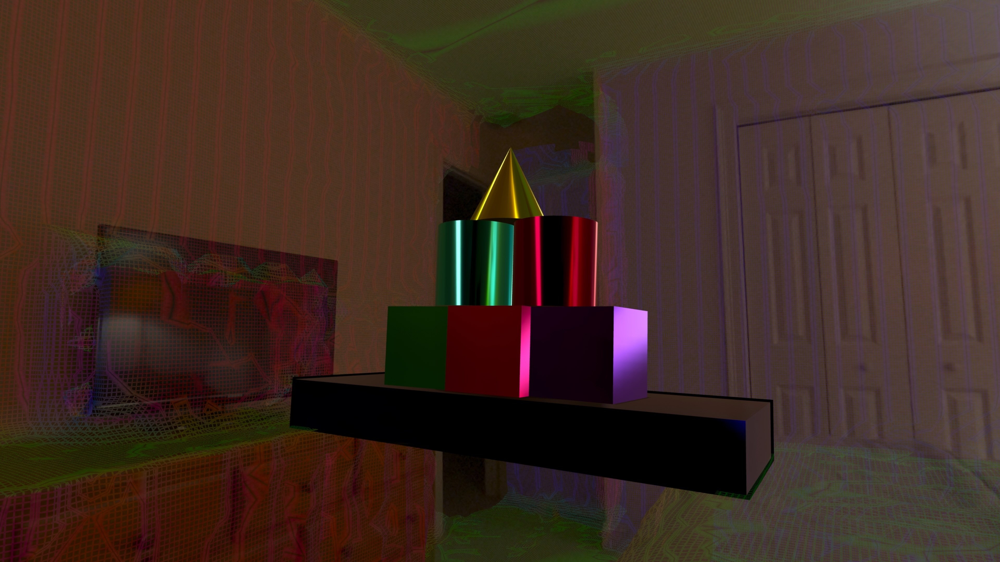
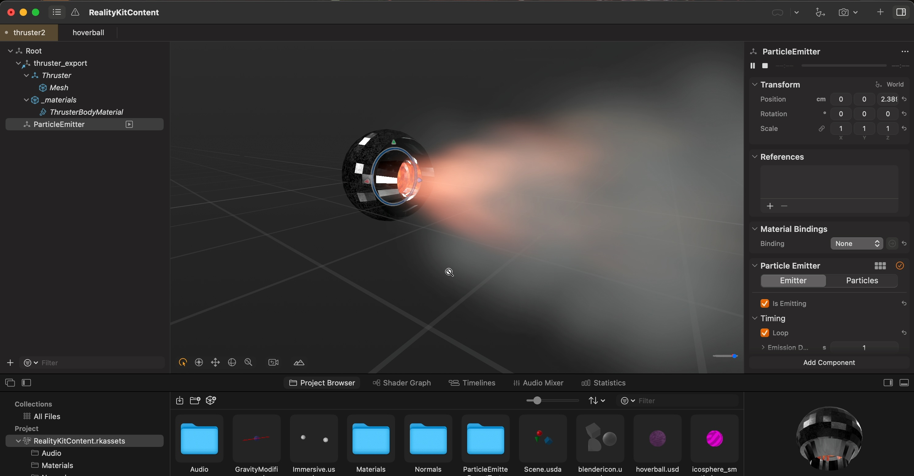
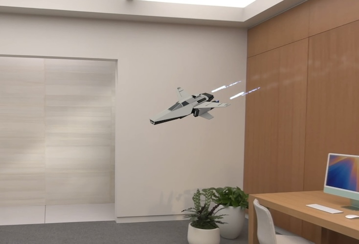


{}
*Debug view of the hand gesture implementation*
{}

>**visionOS Version**: 2.2  
>**Difficulty**: Advanced  
>**Related Projects**: [Spatial Physics Playground](/project/2024-physics-playground/)



---


{}

## Introduction

<!--
* What is the goal of this post?
  * Implement custom hand gestures for Apple Vision
  * Use the gestures to control some kind of 'toy' in the Spatial Physics Playground app
* Prompt: How do you implement meaningful custom hand gestures for Apple Vision?
  * The idea needs to be simple enough for a first attempt at integrating hand gestures.
-->

Hello!

I've spent a bunch of time in 2024 working on my [Spatial Physics Playground](/project/2024-physics-playground) app for Apple Vision. I've been treating it as a way to keep learning new things. So much so that I've forgotten to write anything on my blog for the whole year. Whoops.

To help rectify that, I wanted to write up a few how-to posts on some of the things I've learned, just to help solidify it in my own mind. This post in particular will guide you through implementing custom hand gestures for Apple Vision. We'll be using these gestures to control a Thruster toy in the Spatial Physics Playground app, by adjusting its strength and toggling it on and off without the user needing to use UI buttons.

There's also not a whole lot of tutorials like this written for Apple Vision development yet, and I wanted to try writing out a longer-form tutorial than what I've done in the past.

To be honest, this post might be a little **too** long, but I didn't want to break it up into parts.

Hopefully you can find some use from it! If you have questions or feedback about issues in my post (I'm sure there's at least a few), feel free to reach out to me:



### Goals

The goal of this tutorial is to use ARKit hand tracking data to implement custom hand gestures inside an app for Apple Vision.

This post will require quite a bit of math, so if you aren't familiar with linear algebra you may have a little trouble following along. Hopefully I've been able to simplify it enough for anyone to understand, but I lack the perspective to know for sure.

With the goal in mind our question then becomes "How can you implement meaningful custom hand gestures for Apple Vision?"

For my first attempt at learning and writing this code, I needed something simple enough to implement so I'm not completely overwhelmed. I also wanted an idea that would be fun to use as a user of my app.

But it'll be hard to discuss what I implemented without first discussing the app.

Don't worry, it'll be quick.

### What is Spatial Physics Playground?


{}
*An image of Spatial Physics Playground*
{}

<!--
* Introduce Spatial Physics Playground
  * What is the app?
  * What are 'toys' in the app?
* Idea for SPP: Add a Thruster that can be attached to other objects which integrates hand gestures.
-->

Spatial Physics Playground began its life as me re-implementing a sample project in Apple's documentation, [Incorporating real-world surroundings in an immersive experience](https://developer.apple.com/documentation/visionos/incorporating-real-world-surroundings-in-an-immersive-experience).

It's more of a sandbox than a real game, there's no objective or goals. You simply place physics objects into your room and interact with them by poking them with your finger, throwing them around your room, or attaching various objects to them like ropes or hoverballs. You can also change gravity, slow down time, and just generally mess around with the physics simulation provided by RealityKit.



> Well, *actually*, Physics Playground was **truly** conceived of while I was in college learning Unity. I made a simple physics toy where you used the mouse cursor to pick up and move cubes around an empty scene via a stretchy cable. Basically, a fidget toy.
> 
> I then re-opened that project when I got my HTC Vive and found it was just as fun to play around with in VR as it was on a 2D screen. When I got my Apple Vision, the idea obviously came back to me. This time, it would use your real-world environment as the backdrop for the physics simulation.
>
> None of this really matters to the tutorial, though. So let's get back to it.



The elements like ropes and hoverballs are in a category of tools that I call "toys" which are really just excuses for me to implement things. There's a "marbles" tool which I used to figure out how to randomly place a lot of objects so it looks interesting when they fall. A "hoverball" tool ripped out of Garry's Mod, which lets physics objects float around your room. And so on and so forth.


{}
*The hoverballs in action*
{}

My previous experience with retrieving hand state was with implementing hand interaction with physics objects (i.e. poking them). That's pretty simple as far as detection goes, as all that I really need to do as a developer was place a physics object at the user's finger.

Let's make an actual toy that uses hand gestures for some type of control. And since Garry's Mod was just such a great source of inspiration with my hoverball tool, how about we ~~steal~~ borrow another idea from it?

### The Thruster Toy


{}
*An early version of the thruster in Reality Composer Pro*
{}

<!--
* What is the Thruster?
  * Basically stolen from Garry's Mod.
  * A simple object that can be attached to other objects in the app.
  * When activated, it applies a force to the object it is attached to.
  * The specifics of the truster implementation aren't important for this post.
  * Many things are going to be glossed over in favor of making a more clear tutorial.
-->

The idea for the toy is simple. The hoverball tool works by applying a constant upward force to the object it's attached to. Let's just change which direction the force is being applied (and maybe even vary the strength) and we have a thruster!

The specifics of the thruster implementation (such as actually applying forces to objects or how to integrate particles into the thruster) aren't important for this post, though. In fact, I'm going to try as hard as possible to gloss over a lot of how the thruster works internally. Not because I want to keep it a secret, but just look at how small your scroll bar is! I'm trying to keep this thing as brief as possible. (And clearly not doing a very good job at it!)

Let's consider how we can implement hand gestures to control the thruster.

### Hand Gesture Idea

<!--
* Remember, it needs to be simple to implement.
* It also needs to complement the system-wide user interface.
* The index finger is taken over by the system for most gestures.
* How about a middle finger tap and drag gesture?
  * Tap to toggle the thruster on and off.
  * Drag to control the thruster's strength.
* Let's do it!
-->

Originally, the idea was to have the user just point with their index finger in a direction they wanted the thruster to go.

But then Apple released their [WWDC Spaceship demo](https://developer.apple.com/documentation/realitykit/creating-a-spaceship-game), which is probably the better implementation of that idea. (You can see how the spaceship controls on this [Reddit post](https://www.reddit.com/r/VisionPro/comments/1dga8r8/the_new_spaceship_example_app_from_wwdc_has_some/))


{}
Seriously, how am I supposed to compete with that?
{}

The point of my app isn't to navigate a spaceship, it's to play around with physics objects. So I decided to go with something else.

How about we limit ourselves to just tap and drag gestures for our first attempt at implementing something. Even though that sounds very simple, the math won't necessarily be. It's just our first attempt after all, we can get more complex later.

The "tap" gesture will be the user touching anywhere along their finger with their thumb. The "drag" gesture will be the user dragging their thumb up and down their finger.

The index finger is pretty much the default system-wide tap gesture finger. It would be confusing to add additional gestures on top of that, so let's use the middle finger instead.

What are the natural controls for a tap and drag gesture to be attached to in the context of a thruster that's moving around the scene? I think tapping to toggle the thruster being on and off sounds reasonable, and you can then have the dragging control the thruster's strength.

<!-- Stretch TODO: Picture depicting the controls. Split into two halves. Left side: tap gesture, right side: drag gesture. -->
<!-- Would be helpful for people just scrolling through, looking at the pictures. -->

Sounds good to me! Let's get started.

## Planning

### What's Provided by ARKit?

I always like to start by taking a quick look at the documentation before I get started writing code. It helps to know what data you're going to have available before you start thinking about how the implementation is going to work.


{}
Image courtesy of [Substack - Stuart Varrall](https://varrall.substack.com/p/hand-tracking-in-visionos)  
Original source [Apple - Meet ARKit for spatial computing](https://developer.apple.com/videos/play/wwdc2023/10082/?time=933)
{}

<!--
* Let's first look at what data is provided by ARKit.
* Using the above image, you can see that we're provided with a lot of joints for each hand.
* Each joint has a position and rotation that we can use to implement our hand gestures.
* We're going to focus on the thumb and middle finger joints for this gesture.
  * Specifically `.handThumbTip` (number `4`), `.handMiddleFingerTip` (number `14`), and `.handMiddleFingerKnuckle` (number `11`).
-->

The image above shows the joints that ARKit provides for each hand. When data is provided to us, these are the individual joints that are going to be tracked.

Looking into the documentation a bit more (which we'll go over later), we find that each joint has a transform associated with it, which will give us its position and orientation.

...

Phew, I'm tired of looking at documentation. Thankfully, this sounds like all we need to get started.

For our implementation, we'll be taking a look at the thumb and middle finger joints. Specifically, we'll be looking at the `.handThumbTip` (number `4`), `.handMiddleFingerTip` (number `14`), and `.handMiddleFingerKnuckle` (number `11`) joints. Using these joints, I think we'll be able to implement our tap and drag gestures.

### The Idea, Mathematically

{}
*A visualization of the math behind the gesture recognition*
{}

<!--
* The plan: project the thumb tip onto an imaginary line that extends from the middle finger tip to the middle finger knuckle.
  * Then we can see how far away the thumb is from this line.
  * If the thumb is close enough to the line, we can consider it to be 'touching' the middle finger.
  * At that point, we can see if the thumb starts to move up or down the middle finger (drag), or if it moves away without moving up or down (tap).
* For simplicity, it'll just be a single line, even though most people bend their fingers a little bit naturally.
* Further refinements could break it down further into two or even three line segments that get tracked.
  * Two segments: Middle finger tip -> middle finger intermediate base -> middle finger knuckle
  * Three segments: Middle finger tip -> middle finger intermediate tip -> middle finger intermediate base -> middle finger knuckle
* This is where Linear Algebra comes in.
  * Given a point and a line, projection provides us with the closest point on that line to that point.
    * (No, this isn't the real, formal definition of projection. That would be getting too much into the weeds of math, and we're trying to keep this simple.)
  * Seems relevant to our problem, we need to know if the thumb is touching this imaginary line, and to do that we need to know the closest point on the line to the thumb.
  * The projection formula will also give us a number we can use to see if the thumb is moving up or down the line as well. Useful for a drag gesture!
* Well, we can't put it off any longer. It's time to talk about math.
-->

The plan is to project the thumb tip onto an imaginary line that extends from the middle finger tip to the middle finger knuckle. Then, we can see how far away the thumb is from this line.

If the thumb is close enough to the line, we can consider it to be 'touching' the middle finger. At that point, we can see if the thumb starts to move up or down the middle finger (drag), or if it moves away without moving up or down (tap).

For simplicity, we'll just be using this single line. Further refinements of this implementation could break this down into multiple line segments. Probably at least two, one from the middle finger tip to the "Intermediate Base" joint (number `12` in the diagram above), then one from there to the knuckle.


{}
*Using two line segments better tracks bends in the user's middle finger*
{}

For overkill, you could even have three different line segments, one between each tracked joint!

However, for now we'll just stick to the single line segment. This post is already long enough as it is. We can always refine the implementation after we've got the basics down.

----

Those of you who fear math, now's the time you might start worrying a little bit. As we're about to enter the realm of...*linear algebra*.


{}
*DALL-E 3 - OpenAI*

*Forgive me for using AI-generated images.  
Hopefully it's okay when it's dumb?*
{}

Given a point and a line, as we have above, **projection** provides us with the point on the line which is closest to our provided point.

This is a concept that's going to be very useful for our problem. We need to know if the thumb is touching this imaginary line, and to do that we need to know the closest point on the line to the thumb.

As part of this, the projection formula will also provide us with a way we can track the thumb's movement up and down the middle finger over time. Useful for a drag gesture!

...

Well, we can't put it off any longer. It's time to talk about math.

### Background Math: Linear Algebra

#### The Line Projection Formula

This part used to have a whole giant explanation of how to derive the projection formula for projecting a point onto a 1D line. (I know, right? This post used to be *way* longer.)

But I realized that it's not really necessary for you to understand how to derive the formula to implement the gestures. I just wanted to be snarky about how unreadable Mathematical Wikipedia can be. You can thank me later for sparing you the pain.

So...here's what you need to know. The formula for projecting an n-dimensional point onto a 1D line is:

\[ P_A(\mathbf{v}) = \frac{\mathbf{u} \cdot \mathbf{v}}{\mathbf{u} \cdot \mathbf{u}} \mathbf{u} \]

Where:
* \( P_A(\mathbf{v}) \) is the projected point
* \( \mathbf{u} \) is the basis vector of the line you're projecting onto
* \( \mathbf{v} \) is the point you're going to project (but have not yet)

Both u and v are n-dimensional vectors, but in our case we're going to be working in 3D space.

#### Dot Products
<!--
* What is a dot product?
  * A dot product is a way of multiplying two vectors together to get a scalar value.
    * (A scalar value is just a single number, not a vector.)
  * The dot product of two vectors is the sum of the products of their corresponding components.
  * So, for example, the dot product of two 3D vectors is:
  * \( \mathbf{u} \cdot \mathbf{v} = u_1 v_1 + u_2 v_2 + u_3 v_3 \)
  * Or, in code: `(u.x * v.x) + (u.y * v.y) + (u.z * v.z)`
* Dot products have many, many uses and are well worth familiarizing yourself with, if you haven't already.
* This post won't dive into how to use dot products (remember them if you need to know the angle between two vectors!), but they'll be a part of our implementation.
-->

In case you're completely unfamiliar with dot products (the dots between the letters in the formula), they're just a way of multiplying two vectors together to get a scalar value (or, in other words, just a regular number, not a vector).

Dot products have many, many uses and are well worth familiarizing yourself with, if you haven't already.

This post won't dive into how to mathematically use dot products (remember them if you need to know the angle between two vectors!), but here's what you should know at the very least:

The dot product of two 3D vectors is the sum of the products of their corresponding components. So, for example, the dot product of two 3D vectors is:

\[ \mathbf{u} \cdot \mathbf{v} = u_1 v_1 + u_2 v_2 + u_3 v_3 \]

Or, in code: `(u.x * v.x) + (u.y * v.y) + (u.z * v.z)`

But in actual practice, it's actually more often like:

```swift
dot(u, v)

 // Or sometimes,
u.dot(v)
```

...and similar.

### How to Implement Tap Gesture?
<!--
* Okay, so we have the thumb's position projected onto the line. What now?
* Now we need to know whether the thumb is touching the line.
* That sounds like a distance calculation to me.
* While the thumb remains within a certain radius of the projected point on the line, the thumb is considered to be 'touching' the middle finger
  * We don't know how thick the user's middle finger is, so we need to pick a reasonable threshold. Likely through testing out the gesture to see what feels best.
  * Keep in mind that since we're only using a single line segment that goes from finger tip directly to the knuckle, and most people are naturally going to bend their fingers a little bit, the imaginary line is likely going to mostly go through the air in front of the user's middle finger.
  * So the threshold should be large enough so that the thumb can't accidentally go 'through' this line too far and exit out the back.
  * 
-->

At this point, you hopefully have a good idea of how you might implement the projection formula in code. This gives us the thumb's projected position on the line. But what now?

Now we need to check whether the thumb is touching the line. To do that, it sounds like we need to calculate the distance between the thumb and the projected position on the line.

In order to consider the thumb 'touching' the middle finger, the thumb has to be within some radius of the projected point on the line.

What radius? Well, we don't know how thick the user's middle finger is. So we'll need to discover a reasonable threshold through testing out the gesture to see what feels best.

Keep in mind that since we're only using a single line segment that goes from the finger tip directly to the knuckle, and most people are naturally going to bend their fingers a little bit, the imaginary line is likely going to mostly go through the air in front of the user's middle finger.


{}
*What you don't want to have happen.*
{}

So the threshold should be large enough so that the thumb can't accidentally go 'through' this line too far and exit out the back.

### How to Implement Drag Gesture?

<!--
* Let's take a closer look at the projection formula and try to break it down a little bit:
* This is the formula we derived earlier:
* \( P_A(\mathbf{v}) = \frac{\mathbf{u} \cdot \mathbf{v}}{\mathbf{u} \cdot \mathbf{u}} \mathbf{u} \)
* To me this looks like *"something"* (\( \frac{\mathbf{u} \cdot \mathbf{v}}{\mathbf{u} \cdot \mathbf{u}} \)) multiplied by the line we're interested in (\( u \)). What is this *"something"*?
* Using the previous section, we can tell that it's a dot product divided by another dot product.
* We know that dot products result in scalar values, which means this whole *"something"* is itself a scalar (again, that it's just a number and not a vector)
* If we know that this *"something"* is a scalar, and we're multiplying it by the line (a vector), then the result has to be a point somewhere along that line.
* So then this *"something"* must be the component that tells us how far along the line the projected point is.
* Let's call it \( \mathbf{t} \):
  * \( t = \frac{\mathbf{u} \cdot \mathbf{v}}{\mathbf{u} \cdot \mathbf{u}} \)
* **`t` is the component that tells us how far along the line `u` the projected point `v` is.**
* If we track this over time, we can tell if the thumb is moving up or down the line.
  * In other words, tracking t over time is how we'll implement the 'drag' gesture.
* We've found our drag implementation!
-->

Let's take a closer look at the projection formula and try to break it down a little bit:

\[ P_A(\mathbf{v}) = \frac{\mathbf{u} \cdot \mathbf{v}}{\mathbf{u} \cdot \mathbf{u}} \mathbf{u} \]

To me, this looks like *"something"* (\( \frac{\mathbf{u} \cdot \mathbf{v}}{\mathbf{u} \cdot \mathbf{u}} \)) multiplied by the line we're interested in (\( u \)). What is this *"something"*?

Well, we can tell that it's a dot product divided by another dot product. And thanks to the section on dot products, we also know that using them results in scalar values, which means this whole *"something"* is itself a scalar (again, that it's just a number and not a vector).

If we know that this *"something"* is a scalar, and we're multiplying it by the line (a vector), then the result has to be a point somewhere along that line.

So then, this *"something"* must be the component that tells us how far along the line the projected point is. Let's call it \( \mathbf{t} \):

\[ t = \frac{\mathbf{u} \cdot \mathbf{v}}{\mathbf{u} \cdot \mathbf{u}} \]

**`t` is the component that tells us how far along the line `u` the projected point `v` is.**

If we track this over time, we can tell if the thumb is moving up or down the line. In other words, tracking `t` over time is how we'll implement the 'drag' gesture.

### Combining Tap and Drag Gesture Recognition

<!--
* At this point you might think we're ready to dive into implementing things, but hold on.
* We need to consider what happens when we combine the availability of both gestures.
* We know when the user has begun to touch their thumb to their middle finger, but we don't exactly know which gesture they're about to perform.
* People aren't machines, and the hand tracking isn't perfect, so our code is always going to see some slight up and down movement as the user moves their fingers, even as they're attempting to perform a tap gesture.
* There needs to be some minimum threshold for movement up and down the line before we consider the action a drag gesture.
  * Again, discovered through testing.
* It also helps to consider how long the user has been touching their thumb to their middle finger when determining the gesture.
  * If the touch time is longer than a second, it's unlikely the user is attempting a tap gesture.
  * Likewise, if we detect a large drag in less than a quarter of a second, it's unlikely the user meant to perform a drag gesture.
* We'll need to consider these factors when implementing the gesture recognition system.
-->

At this point, you might think we're ready to dive into implementing things, but hold on. We need to consider what happens when we combine the availability of both gestures.

We know when the user has begun to touch their thumb to their middle finger, but we don't exactly know which gesture they're about to perform. People aren't machines, and the hand tracking isn't perfect, so our code is always going to see some slight up and down movement as the user moves their fingers, even as they're attempting to perform a tap gesture.

There needs to be some minimum threshold for movement up and down the line before we consider the action a drag gesture. Again, this threshold will need to be discovered through testing. There's no way to mathematically figure out the "best" threshold without trying it out for yourself.

It may also help to consider how long the user has been touching their thumb to their middle finger when determining the gesture

If the touch time is longer than a second, it's unlikely the user is attempting a tap gesture. Likewise, if we detect a large drag in less than a quarter of a second, it's unlikely the user meant to perform a drag gesture.

---

I think that's enough planning for now, don't you? How about we dive into some code?

## Implementation

> ⚠️ **Important Note**
> 
> This post was written when visionOS 2.2 was the latest version.
> 
> If you're reading this in the future, some of this code may be outdated.

I'm going to move quickly through the Apple-specific WhateverKit-interfacing code for a couple reasons. First, I'm not writing extensive documentation for Apple for free. And second, Apple-specific code ages like milk (it becomes quickly outdated), so some of these sections are just going to be a quick reference without much explanation.

If you haven't already browsed through Apple's documentation for [Tracking and Visualizing Hand Movement](https://developer.apple.com/documentation/visionos/tracking-and-visualizing-hand-movement), I would recommend you do so first. It'll make understanding this code much easier.

Hopefully Apple hasn't changed the link by the time you're reading this, but if they have feel free to e-mail me and I can update it:



### App Setup

<!--
* Apps on Apple Vision work the same as apps for other Apple platforms.
* But to get to the interesting data, there's some limitations that we'll have to work around.
* For example, certain data can only be obtained under certain circumstances.
  * Specifically, certain data providers (like the hand tracking provider) can only be run inside immersive spaces (where your app is the only one visible to the user).
* Inside your app's `body`, you'll have to create an `ImmersiveSpace`, and a `View` to put inside it.
-->

Apps on Apple Vision work the same as apps for other Apple platforms. But to get to the interesting data, there's some limitations that we'll have to work around.

For example, certain data can only be obtained under certain circumstances. Specifically, certain data providers (like the hand tracking provider) can only be run inside immersive spaces (where your app is the only one visible to the user).

Inside your app's `body`, create an `ImmersiveSpace`, and a `View` to put inside it.

```swift
@main
struct MyCoolApp : App {
  @state private var viewModel = ViewModel()
  @state private var handTrackingModel = HandTrackingModel()

  var body: some Scene {
    WindowGroup {
      DefaultView()
        .environment(viewModel)
    }

    ImmersiveSpace {
      ImmersiveView()
        .environment(handTrackingModel)
        // Allows you to render things over the user's hands.
        // Useful for debug visualizations
        .upperLimbVisibility(.hidden)
    }
  }
}
```
{}
*This code sets up the main application structure, initializing the view models and configuring the immersive space with the necessary environment models.*
{}

### Hand Tracking Provider Setup

Let's set up the data provider, which provides us data...about the transforms of the user's hand joints.

Inside your immersive view, or perhaps inside a `HandTrackingModel` struct, create an `ARKitSession` and `HandTrackingProvider`

```swift
@Observable
class HandTrackingModel {
  let arSession = ARKitSession()
  let handTracking = HandTrackingProvider()
}
```

When the user enters the immersive view, request authorization for hand tracking and start the hand tracking provider.

```swift
struct ImmersiveView : View {
  @Environment var handTrackingModel: HandTrackingModel

  var body: some View {
    // ...
  }.task {
    do {
      var dataProviders: [DataProvider] = [] // Required providers

      if await handTrackingModel.handTrackingIsAuthorized() {
        dataProviders.append(handTrackingModel.handTracking)
      } else {
        // Handle not having hand tracking available
      }

      try await arSession.run(dataProviders: dataProviders)
    } catch {
      // Handle error
    }
  }
  .task {
    await handTrackingModel.processHandTrackingUpdates()
  }
}
```

```swift
class HandTrackingModel {
// ...
    func handTrackingIsAuthorized() async -> Bool{
      // You may want to call this function *before* the ImmersiveView is shown,
      // if you'd like to control when the user is asked for permissions.
      return await arSession.requestAuthorization(for: HandTrackingProvider.requiredAuthorizations)
        .allSatisfy{ authorization in authorization.value == .allowed }
    }
/// ...
}
```

Remember to add `NSHandsTrackingUsageDescription` to your app's `Info.plist` file. Otherwise, your app will crash when you call `requestAuthorization`.

```xml
<!-- ... -->
<key>NSHandsTrackingUsageDescription</key>
<string>A short description explaining why your app needs this permission.</string>
<!-- ... -->
```

### Handling Updates and Storing State

Let's store the latest state of the user's hands in some variables. First, let's define a struct to store this state.

```swift
struct HandsStatus {
    var left: HandAnchor?
    var right: HandAnchor?
    
    // Useful utility function:
    func forChirality(_ chirality: HandAnchor.Chirality) -> HandAnchor? {
        if chirality == .left {
            left
        } else {
            right
        }
    }
}
```
{}
*(Yes, this could probably just be a Dictionary instead of a struct, but this is what it was in my app.)*
{}

And let's store the latest hand state in a global that can be accessed by the System that we're going to implement later.

```swift
// In global scope, possibly inside a Globals.swift or similar.
var latestHandTracking = HandsStatus()
```

I dislike using global variables, but it's what I did in Spatial Physics Playground (which was based off some Apple documentation sample code).

I haven't yet found a way to avoid it, either, as there doesn't seem to be any mechanism to transfer external data into a System. Refactoring out the global is left as an exercise for the reader...and my future self 😊.

Now let's update the `HandTrackingModel` to store the latest hand state.

```swift
class HandTrackingModel {
  // ...
  func processHandTrackingUpdates() async {
    for await update in handTrackingProvider.anchorUpdates {
      switch update.event{
      case .updated:
        let anchor = update.anchor
        
        if anchor.isTracked {
          // Update the appropriate hand info
          if anchor.chirality == .left {
            latestHandTracking.left = anchor
          } else if anchor.chirality == .right {
            latestHandTracking.right = anchor
          }
        } else {
          // Anchor has been lost, set hand tracking to nil.
          if anchor.chirality == .left {
            latestHandTracking.left = nil
          } else {
            latestHandTracking.right = nil
          }
        }
          
      default:
        break
      }
    }
  }
  // ...
}
```

### Setting up a ThrusterSystem

<!--
* Remember to read [Apple's documentation](https://developer.apple.com/documentation/realitykit/implementing-systems-for-entities-in-a-scene) about implementing RealityKit Systems, if you haven't already.
* We'll need a System that's responsible for doing things based on the user's current hand state.
* The system will need to determine (and store) 
  * The current/previous t values
  * Whether the thumb is/was touching the imaginary line
  * etc.
* Then use the stored information to affect the simulation
  * Updates the thruster strength based on the t value.
  * Toggles the thruster on and off based on the tap gesture.
* Let's define a stub System for now to get us started.
-->

Remember to read [Apple's documentation](https://developer.apple.com/documentation/realitykit/implementing-systems-for-entities-in-a-scene) about implementing RealityKit Systems, if you haven't already.

We're going to need a System that's responsible for doing things based on the user's current hand state. The system will need to determine (and store) the current/previous t values, whether the thumb is/was touching the imaginary line, etc.

Then, the System will use the stored information to affect the simulation. For example, it will update the thruster strength based on the t value, and toggle the thruster on and off based on the tap gesture, and so on.

Let's define a stub System for now to get us started.

```swift
class ThrusterSystem : System {
  required init(scene: Scene) { }

  func update(context: SceneUpdateContext) {
    // TODO: This.
  }
}
```

Systems search through entities within a scene by using Components primarily (well, my Systems do), so let's make a Thruster Component.

```swift
struct ThrusterComponent : Component {
  var enabled: Bool
  var strength: Float
}
```

This is enough to let us toggle the thruster and adjust its strength at runtime. We'll need to remember to add this component to the Entity when the user creates a Thruster in the app (but that's for me to worry about, not you 😊).

We're also going to need a structure to hold the thumb's state inside the `ThrusterSystem`.
  
```swift

class ThrusterSystem : System {

  struct ThumbStatus {
    // t-value tracking
    var currentT: Float = 0.0
    var previousT: Float = 0.0

    // totalTChange:
    // Increases as the user moves their thumb either up or down the line
    // NOT meters, this is % of length of user's middle finger
    var totalTChange: Float = 0.0 

    var contactTime: Float = -1.0
    var justReleased: Bool = false

    // When justReleased is true, the variables below will help us determine what the user is doing.

    // isDrag: User is performing a drag gesture
    // Threshold of 0.01 was arbitrarily chosen, and seems to work well enough.
    // Increase for more 'deadzone' before a drag is detected.
    var isDrag: Bool { totalTChange > 0.01 } // i.e. 1% of the length of the user's middle finger

    // isTap: User is performing a tap gesture
    // Again, thresholds were chosen arbitrarily and work okay. Adjust as needed.
    var isTap: Bool { !isDrag && contactTime > 0.05 && contactTime < 0.5 }

    mutating func reset() {
      currentT = 0.0
      // and all the other variables...
      // (removed for brevity)
    }
  }

  private var handStatus: [HandAnchor.Chirality: ThumbStatus] = [
    .left: ThumbStatus(),
    .right: ThumbStatus()
  ]

  required init(scene: Scene) { }

  func update(context: SceneUpdateContext) {
    // Still TODO...☹️
  }
}
```

Let's work on implementing that `update` function!

### Implementing the System Update Function

The update function will need to be broken up into two sections.

First, for each hand, we need to process the joint data and determine the thumb's position on the imaginary line, and if it's moved up or down.

Second, we need to update `ThrusterComponent` state based on the thumb state, then apply thruster forces to the entity.

So let's implement it.

```swift

class ThrusterSystem : System {
  // ...
  func update(context: SceneUpdateContext) {
    // Part 1 - Update thumb contacts
    let deltaTime = Float(context.deltaTime)
    let handTrackingAvailable = latestHandTracking.left != nil || latestHandTracking.right != nil
    let isTapping: Bool
    let strengthChange: Float

    if handTrackingAvailable {
      // Implementation coming later:
      self.updateThumbContacts(deltaTime: deltaTime)

      // These two are implemented below:
      isTapping = self.determineTap()
      strengthChange = self.determineDrag()
    } else {
      // Explanation and implementation coming next:
      resetThumbContact(.left)
      resetThumbContact(.right)
      isTapping = false
      strengthChange = 0.0
    }

    // Part 2 - Update thruster components
    let query = EntityQuery(where: .has(ThrusterComponent.self))
    for thruster in context.entities(matching: query, updatingSystemWhen: .rendering) {
      if let thrusterComponent = thruster.components[ThrusterComponent.self] {
        if isTapping {
          thrusterComponent.enabled.toggle()
        }

        if abs(strengthChange) > 0.0 {
          let finalStrength = max(0.0, thrusterComponent.strength + strengthChange)
          thrusterComponent.strength = finalStrength
        }

        thruster.components[ThrusterComponent.self] = thrusterComponent
      }

      // Apply forces, etc.
    }
  }

  func determineTap() -> Bool {
    for chirality in [
      HandAnchor.Chirality.left,
      HandAnchor.Chirality.right
    ] {
      // If just released and isTap, then the user is tapping.
      if self.handStatus[chirality]!.justReleased && self.handStatus[chirality]!.isTap {
        return true
      }
    }

    return false
  }

  func determineDrag() -> Float {
    // We haven't discussed how to handle dragging with multiple hands simultaneously.
    // Here, we'll just handle it by taking the first hand we see that's dragging.
    // You may need to adjust for your own use cases.
    for chirality in [
      HandAnchor.Chirality.left,
      HandAnchor.Chirality.right
    ] {
      if self.handStatus[chirality]!.isDrag {
        guard let previousT = self.handStatus[chirality]?.previousT,
              let currentT = self.handStatus[chirality]?.currentT else { continue }
        
        return currentT - previousT
      }
    }

    return 0.0
  }
}
```
<!--
* This should be mostly self-explanatory except for `resetThumbContact` and `updateThumbContacts`.
* `updateThumbContacts` is going to be a big function with its own dedicated section, so let's skip that for now.
* Let's explain `resetThumbContact`:
  * The way this will work is, as long as the user isn't touching their middle finger with their thumb, `resetThumbContact` will be called every frame.
  * The first frame the user lets go of their middle finger, this function will only set the `justReleased` flag to true and do nothing else.
  * The frame afterward, we will be able to check this flag in the System to do our logic (toggle the thruster on or off).
  * After that update is complete, `resetThumbContact` will be called again to actually clear the thumb state.
  * Further calls to `resetThumbContact` will be made every frame afterward, but do nothing until the user touches their middle finger again.
  * Hand tracking being lost will be handled by simply going through this same process (calling `resetThumbContact` every frame there's no hand tracking available).
* Here's the implementation:
-->

Despite being long, this code should be mostly self-explanatory. The only functions we haven't discussed are `resetThumbContact` and `updateThumbContacts`.

### Resetting Thumb Contact

The way this works is that as long as the user isn't touching their middle finger with their thumb, then `resetThumbContact` will be called every frame.

The first frame after the user lets go of their middle finger, this function will only set the `justReleased` flag to true and do nothing else.

The frame afterward, we will be able to check this flag in the System to do our logic (toggle the thruster on or off). After that update is complete, `resetThumbContact` will be called again to actually clear the thumb state.

Further calls to `resetThumbContact` will be made every frame afterward, but do nothing until the user touches their middle finger again.

This provides us an easy way to hand hand tracking being lost: simply go through this same process (calling `resetThumbContact` every frame there's no hand tracking available).

Here's the implementation:

```swift
class ThrusterSystem : System {
  // ...
  func resetThumbContact(_ chirality: HandAnchor.Chirality) {
    // If justReleased is true, then we need to actually clear the state.
    if self.handStatus[chirality]?.justReleased ?? false {
      // Clear state
      self.handStatus[chirality]?.reset()
    } else if self.handStatus[chirality]!.contactTime > 0.0 {
      // Only set justReleased if the user has made contact for at least one frame.

      // justReleased hasn't been set yet, so set it.
      self.handStatus[chirality]!.justReleased = true
      // Preserve state so that other functions can use it until next frame.
    }
  }
}
```

### Updating Thumb Contacts

<!--
* We've got the framework in place, now we just have to implement `updateThumbContacts`.
* Before we begin, let's take a look at what data we have available to us from the hand tracking provider.
* We're passing the data to our System via the global variable `latestHandTracking`, which is is a structure we made earlier that contains two optional `HandAnchor` objects, one for each hand.
* Looking at the [Apple Documentation](https://developer.apple.com/documentation/arkit/handanchor), we can see that we'll need to use the `handSkeleton` property to get to the joint data.
* The [HandSkeleton](https://developer.apple.com/documentation/arkit/handskeleton) object contains a function `joint(_ named: HandSkeleton.JointName)` we can use to get data about a specific joint.
* The [HandSkeleton.Joint](https://developer.apple.com/documentation/arkit/handskeleton/joint) object contains a `anchorFromJointTransform` property that we can use to get the position of the joint relative to its hand anchor.
* You may be a desire to also use the `originFromAnchorTransform` property on the `HandAnchor` object to convert the joints to world space.
  * However, we don't need to do this. After all, we're not interested in the world position of these joints. Only their relative positions to each other, all of which are under the same `HandAnchor`.
  * The math is the same, no matter what basis you're using for your coordinate system, so long as all your data uses that same basis.
  * No need to waste time calculating the world transform matrix for each joint if we don't have to.
* Plan in place, let's write just a little bit of `updateThumbContacts`.
-->

We've got the rest of the framework in place, now it's time to implement `updateThumbContacts`. Before we begin, let's take a look at what data we have available to us from the hand tracking provider.

We're passing the data to our System via the global variable `latestHandTracking`, which is a structure we made earlier that contains two optional `HandAnchor` objects, one for each hand.

Looking at the [Apple Documentation](https://developer.apple.com/documentation/arkit/handanchor), we can see that we'll need to use the `handSkeleton` property to get to the joint data.

The [HandSkeleton](https://developer.apple.com/documentation/arkit/handskeleton) object contains a function `joint(_ named: HandSkeleton.JointName)` we can use to get data about a specific joint.

The [HandSkeleton.Joint](https://developer.apple.com/documentation/arkit/handskeleton/joint) object contains a `anchorFromJointTransform` property that we can use to get the position of the joint relative to its hand anchor.

> **💬 Note**
>
> You may have a desire to also use the `originFromAnchorTransform` property on the `HandAnchor` object to convert the joints to world space.
>
> However, we don't need to do this. After all, we're not interested in the *world* position of these joints. Only their relative positions to each other, all of which are under the same `HandAnchor`.
>
> The math is the same, no matter what basis you're using for your coordinate system, so long as all your data uses that same basis. There's no need to waste time calculating the world transform matrix for each joint if we don't have to.

Plan in place, let's write just a little bit of `updateThumbContacts`.

We're going to loop through each hand, updating the thumb's status for each hand. If tracking data isn't available for a hand, we'll go through the `resetThumbContact` process to ensure the state is reset.

```swift
class ThrusterSystem : System {
  // ...
  func updateThumbContacts(deltaTime: Float) {
    for chirality in [
      HandAnchor.Chirality.left,
      HandAnchor.Chirality.right
    ] {
      guard let handAnchor = latestHandTracking.forChirality(chirality),
            let thumbTip = handAnchor.handSkeleton?.joint(.thumbTip),
            let middleFingerTip = handAnchor.handSkeleton?.joint(.middleFingerTip),
            let middleFingerKnuckle = handAnchor.handSkeleton?.joint(.middleFingerKnuckle) else {
        // Hand not tracked, skip
        resetThumbContact(chirality)
        continue
      }

      // -- Mark 1 --
      // ...
    }
  }
}
```

Now let's extract the joint positions.

#### Obtaining Joint Positions

At this point, we have the transformation matrix of each joint, which tells us the position and orientation of the joint relative to the hand anchor.

A transformation matrix is a 4x4 matrix, of which the last column is the position of the joint. However, all we need is a 3D vector, so we take the first three elements of the final column.

```swift
class ThrusterSystem : System {
  // ...
  func updateThumbContacts(deltaTime: Float) {
    // ...
    // -- Mark 1 --

    // Get the positions of the joints (relative to the hand anchor)
    let thumbPosition = thumbTip.anchorFromJointTransform.columns.3[SIMD3(0, 1, 2)]
    let middleFingerTipPosition = middleFingerTip.anchorFromJointTransform.columns.3[SIMD3(0, 1, 2)]
    let middleKnucklePosition = middleFingerKnuckle.anchorFromJointTransform.columns.3[SIMD3(0, 1, 2)]

    // -- Mark 2 --
    // ...
  }
}

```

#### Calculating U and V of the Projection Formula

<!--
* Remember our formula from earlier?
  * From way back when?
  * ...It's been a while, hasn't it?
  * It's time to implement it.
  * \( P_A(\mathbf{v}) = \frac{\mathbf{u} \cdot \mathbf{v}}{\mathbf{u} \cdot \mathbf{u}} \mathbf{u} \)
* In our case, u is the line from the middle finger tip to the middle finger knuckle, and v is the thumb tip.
  * But `u` and `v` don't make good programming variable names, so let's rename them to something more descriptive.
  * Let's use `lineAB` for the line we're projecting onto (middle finger tip to knuckle).
  * And use `pointP` for the point we're projecting.
* For the projection formula to work, we have to provide `pointP` in the same basis as `lineAB`.
  * So we'll need to calculate the thumb tip's position relative to the origin of `lineAB`, or in other words, the middle finger tip.
* Implementation:
-->

Remember our formula from earlier?

From way back when?

...

It's been a while, hasn't it? It's time to implement it.

\[ P_A(\mathbf{v}) = \frac{\mathbf{u} \cdot \mathbf{v}}{\mathbf{u} \cdot \mathbf{u}} \mathbf{u} \]

In our case, `u` is the line from the middle finger tip to the middle finger knuckle, and `v` is the thumb tip.

But `u` and `v` don't make good programming variable names, so let's rename them to something more descriptive.

Let's use `lineAB` for the line we're projecting onto (middle finger tip to knuckle), and use `pointP` for the point we're projecting.

<!--
    Coordinate Space Consistency:

    All vectors (lineAB and pointP) are calculated relative to the middleFingerTipPosition. This consistent origin ensures that projections and distance calculations are accurate within the context of the user's hand, independent of their position in the world space.
-->

<!--
For the projection formula to work, we have to provide `pointP` in the same basis as `lineAB`. So we'll also need to calculate the thumb tip's position relative to the origin of `lineAB` (in our case, the origin is the middle finger tip).
-->

We have to be careful about our coordinate spaces now. In order for the formula to work, everything has to be in the same coordinate space. Our end result projected position will end up using the basis of `lineAB`, so we'll have to pick which of the two points that define it (middle finger knuckle and middle finger tip) will be the 'origin' for our coordinate system.

In development, I arbitrarily decided to have its origin be the middle finger tip, but could you could also equally use the middle finger knuckle as the origin for the line instead.

So to get `pointP` in the same basis, we need to calculate the thumb tip's position relative to the middle finger tip.

```swift
class ThrusterSystem : System {
  // ...
  func updateThumbContacts(deltaTime: Float) {
    // ...
    // -- Mark 2 --

    // This code uses the middle finger tip as the origin.
    // However, you could equally use the middle knuckle as the origin.
    // Math doesn't care.

    // lineAB (U) - Line from middle finger tip to knuckle (destination - source)
    let lineAB = middleKnucklePosition - middleFingerTipPosition

    // pointP (V) - Position of the thumb tip relative to lineAB's origin
    //             (This is the point we're going to project onto lineAB)
    let pointP = thumbPosition - middleFingerTipPosition

    // -- Mark 3 --
    // ...
  }
}
```

#### Calculating T - Thumb Position on Line

<!--
* Now that we have `lineAB` and `pointP`, we can calculate `t` as explained earlier.
  * \( t = \frac{\mathbf{u} \cdot \mathbf{v}}{\mathbf{u} \cdot \mathbf{u}} \)
* Lines in math extend infinitely, but we're only interested in the line segment we've discussed.
* So we'll clamp `t` to be between 0 and 1.
-->

Now that we have `lineAB` and `pointP`, we can calculate `t` as explained earlier.

\[ t = \frac{\mathbf{u} \cdot \mathbf{v}}{\mathbf{u} \cdot \mathbf{u}} \]

Lines in math extend infinitely, but we're only interested in the line segment we've discussed.

We'll do that by clamping `t` to be between 0 and 1 to ensure that the projected point lies within the line segment defined by the middle finger tip (t=0) and knuckle (t=1). This prevents the thumb's projected position from extending beyond the physical length of the user's finger.

```swift
class ThrusterSystem : System {
  // ...
  func updateThumbContacts(deltaTime: Float) {
    // ...
    // -- Mark 3 --

    let t = dot(lineAB, pointP) / dot(lineAB, lineAB)

    // Clamp t to be between 0 and 1 
    // (To the line segment between the knuckle and tip)
    let tClamped = simd_clamp(t, 0.0, 1.0)

    // -- Mark 4 --
    // ...
  }
}
```

<!--
* (Isn't it nice how easy math is to implement?)
  * (I mean...once you've correctly figured out what math *to* do.)
  * (...You know, the hard part.)
-->

Isn't it nice how easy math is to implement?

I mean...once you've correctly figured out what math *to* do.

...you know, the hard part.

#### Calculating Thumb Distance to Line

<!--
* Now we've got `t` (`Clamped`), we can now calculate the point on the line segment which is closest to the thumb tip.
  * We'll do that by multiplying `tClamped` by `lineAB`, or in other words by completing the projection formula.
  * This will give us the closest point on the line to the thumb tip, in the basis of `lineAB`.
  * When you're doing math you really have to make sure to remember the basis of your vectors.
  * You'll see why in just a second.
* We can take that position, then figure out its distance to the thumb tip.
  * We do this by getting the length of the line from the thumb tip to the closest point on the line.
  * In other words (remembering destination - source) `projectedThumbPosition - `...?
  * `pointP`!
  * "But why not `thumbPosition`?"
    * It's the basis!
    * `thumbPosition` is in the position of the thumb tip **in the basis of the hand anchor**.
    * `pointP` is in the position of the thumb tip **in the basis of the middle finger tip**.
-->

Now we've got `t` (`Clamped`), we can now calculate the point on the line segment which is closest to the thumb tip.

We'll do that by multiplying `tClamped` by `lineAB`, or in other words by completing the projection formula. This will give us the closest point on the line to the thumb tip, or the projected thumb position.

We can take that projected position, then figure out its distance to the actual thumb tip's position. We do this by getting the length of the line from the thumb position to the projected thumb position.

It's important to remember the basis of your vectors when doing math like this. We need the thumb position and the thumb's projected position in the same basis in order to calculate the distance between them.

The result of completing the projection will be in the basis of `lineAB`. So in order to calculate the distance, we'll have to the use the thumb tip's position relative to the middle finger tip. We calculated that already, that's `pointP`.

So, we want the length of the vector `projectedThumbPosition - pointP`.

```swift
class ThrusterSystem : System {
  // ...
  func updateThumbContacts(deltaTime: Float) {
    // ...
    // -- Mark 4 --

    // Calculate the closest point on the line to the thumb tip
    let projectedThumbPosition = tClamped * lineAB

    // Calculate the distance between the thumb and the line
    let distanceBetweenThumbAndLine = simd_length(projectedThumbPosition - pointP)

    // -- Mark 5 --
    // ...
  }
}
```

#### Updating Thumb Status

<!--
* Phew, we've done a lot of math.
* Now we're back into the realm of good ol' programming.
* Now that we know how far the thumb is from the line, we can update the thumb's status with whether it's touching the line or not.
* If it's touching, we update the properties of the thumb status.
* If not, we reset the thumb status.
-->

Phew, we've done a lot of math. Now we're back into the realm of good ol' programming.

Now that we know how far the thumb is from the line, we can update the thumb's status with whether it's touching the line or not.

If it's touching, we update the properties of the thumb status.

If not, we reset the thumb status.

```swift
class ThrusterSystem : System {

  private static let contactDistanceThreshold: Float = 0.025 // In meters, 2.5 cm. Arbitrarily picked, adjust as needed.

  // ...
  func updateThumbContacts(deltaTime: Float) {
    // ...
    // -- Mark 5 --

    if distanceBetweenThumbAndLine < Self.contactDistanceThreshold {
      // Thumb is touching the line
      let newTimeTouching = max(0.0, self.handStatus[chirality]!.contactTime) + deltaTime
      self.handStatus[chirality]!.contactTime = newTimeTouching

      // Update T
      let previousT = self.handStatus[chirality]!.currentT ?? tClamped
      let currentT = tClamped

      self.handStatus[chirality]!.previousT = previousT
      self.handStatus[chirality]!.currentT = currentT
      self.handStatus[chirality]!.totalTChange += abs(currentT - previousT)
    } else {
      // Thumb is not touching the line
      resetThumbContact(chirality)
    }
  }
}
```

<!--
* And that's pretty much it for the `updateThumbContacts` function.
* And that's also pretty much it for the implementation of the `ThrusterSystem` class!
* Let's take a look at what it looks like in action.
  * With some debug visualizations!
-->

And that's pretty much it for the `updateThumbContacts` function.

And that's also pretty much it for the implementation of the `ThrusterSystem` class!

Let's take a look at what it looks like in action.

## Final Result

### Debug Visualization

To better illustrate the system in action, I've created a debug visualization that shows the thumb's projected position on the line, and the line itself. That'll help us see what the system's thinking without needing to also stare at a thruster in the scene.

The final result is showcased in the video at the top of this post. I've also included it here for your convenience:


{}
*A debug visualization of the hand gesture system.*
{}

<!--
* (Explanation of what's happening in the video and what the various colors of the cylinder and sphere represent.)
* Sphere is the user's projected thumb position
* Cylinder is the line from the middle finger tip to the middle finger knuckle
* Cylinder is gray when the thumb is not touching the line at all.
* Cylinder is green when the thumb is touching the line.
* Sphere is yellow when the user hasn't yet moved enough to perform a drag gesture.
* Sphere is blue when the user is detected to be dragging.
-->

In this video, you can see a cylinder has been attached to the user's middle finger, which represents the line segment we've been talking about this whole blog post.

On the cylinder, sliding up and down it, is a sphere that represents the projected position of the user's thumb.

You can see that as I move my thumb to touch my middle finger, things start to change color.

Let's break down what's happening. First with the cylinder, which has two colors, gray and green:

- The cylinder starts out gray, and remains gray when the thumb is not touching the line at all.
- The cylinder turns green when the thumb is detected to be touching the line.

In addition to the cylinder, the sphere also has two colors, yellow and blue:

- As long as the sphere is yellow, the current gesture is assumed to be a 'tap'.
- When the sphere turns blue, the user is detected to be dragging their thumb up or down the line.

The video makes it a little bit difficult to tell how well the gesture works because my finger and thumb are obscured by the visualization, but let me assure you that I've fiddled with the numbers to get things working pretty well (for my hands, at least).

<!-- NOTE: My implementation differs slightly from what I've written here. I've refined the code for this blog post, so there are minor differences between this post and my app. For example: The totalTChange is not absolute in my app, so you'll see it go positive and negative in the video. -->

> **💬 Note**
>
> My implementation differs slightly from what I've written in this blog post. I've refined my code as I wrote this post, so there are minor differences between the video and tutorial.
> 
> For example: The `totalTChange` is not absolute in my app, so you'll see it go positive and negative in the video.


### Conclusion

<!--
* We've implemented a simple hand gesture system for Apple Vision.
* The system allows for a tap and drag gesture to control a thruster in the Spatial Physics Playground app.
* The system is based on projecting the thumb tip onto an imaginary line between the middle finger tip and knuckle.
* The system uses Linear Algebra to calculate the projection and determine the thumb's position relative to the line.
* The system is simple, but effective, and could be expanded upon in the future.
* For example, adding more fingers or more complex gestures such as detecting taps on individual phalanxes (bones) of the fingers by checking the t value when the tap is completed
* Hope you enjoyed this post, and I hope you learned something new about math and/or hand tracking on Apple Vision!
-->

> **💡 Key Takeaways**
> - **Hand Tracking Integration:** We leveraged ARKit's hand tracking to capture complex gesture data.
> - **Mathematical Application:** We applied linear algebra concepts such as projections and dot products to interpret hand movements.
> - **System Implementation:** Finally, we implemented a responsive system that reacts to user gestures to manipulate in-app objects.

In conclusion, this is how I implemented a simple hand gesture system for Apple Vision.

The system allows for a tap and drag gesture to control a thruster in the Spatial Physics Playground app, using some fancy linear algebra.

Simple, but effective, and also open to expansion in the future.

For example, I intend on adding these controls onto each finger independently, and allowing the user to link up thrusters to different fingers.

You could also implement more complex taps, such as detecting taps on individual phalanxes (bones) of the fingers by checking the `t` value when the tap is completed.

There's a lot of different directions you could go!

I hope you enjoyed this post, and I hope you learned something new about math and/or hand tracking on Apple Vision!



