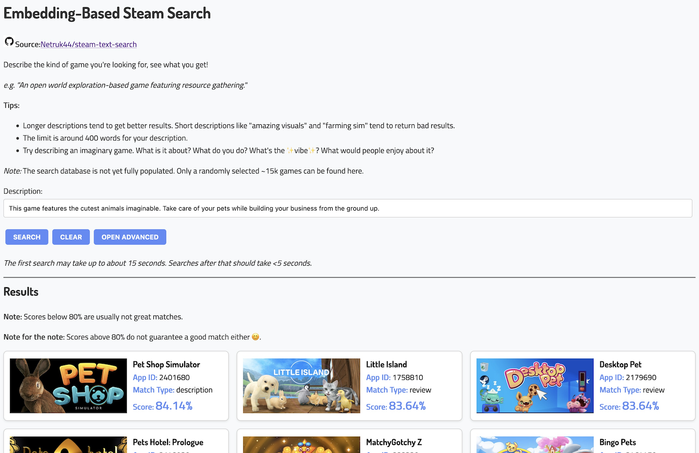

> **URL:** [https://netrukpub.z5.web.core.windows.net/steamvibes/build/index.html](https://netrukpub.z5.web.core.windows.net/steamvibes/build/index.html)
>
> **Source:** GitHub - [Netruk44/steam-embedding-search](https://github.com/Netruk44/steam-embedding-search)
>
> **Model:** [Instructor-XL](https://huggingface.co/hkunlp/instructor-xl) on [HuggingFace](https://huggingface.co/)

I recently had the idea of using machine learning text embedding models to generate embeddings for [Steam](https://store.steampowered.com/) game descriptions and their reviews. Steam game discovery has been a notoriously difficult problem to solve, and I think embeddings could be a really useful tool for helping games become more discoverable.

I've been working on this project for a little while now, and I've gotten to the point where I have a web UI used for querying a database of embeddings. I think that as a first attempt using an off-the-shelf model, it shows some promise for the future. However, search results so far have not been spectacular, but I'm hoping that performance might improve with some slight changes to my implementation, or better future models.

Since I'm going to be waiting a while for the whole database to be populated (it's going to take a few days due to the Steam store's API rate limiting), I thought I would write up a series of blog posts all about how each piece was implemented, and the challenges I faced along the way.

> **Important**: I'm by no means an expert in any of this. I'm just a guy who made a thing and is sharing how he made that thing. I'm sure there are lots of mistakes and optimizations that I could have made all over the place. Feel free to e-mail me about them!
>
> Don't take this as a definitive 'best practices' guide for how to implement something like this. Just as documentation for how one person did it.

I believe that embeddings are a really cool tool that are going to become more and more commonplace as AI models become more advanced, so I hope that this can be useful to anyone who wants to do something similar, or just wants to learn more about how embeddings work.

To check out the final product, head over to the [search page](https://netrukpub.z5.web.core.windows.net/steamvibes/build/index.html) to test it out for yourself. Maybe by the time you're reading this, the database will be fully populated. You can also see the complete source code for every part of this project on [GitHub](https://github.com/Netruk44/steam-embedding-search).

Check out the individual parts below for all the details of how it was made.



## Posts