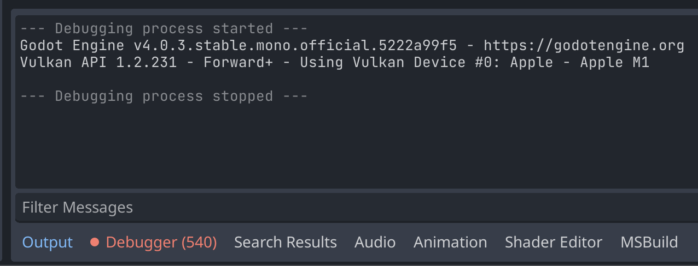
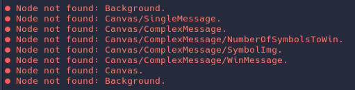
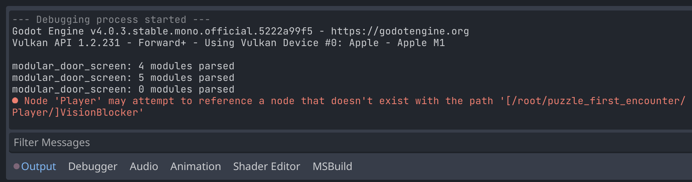
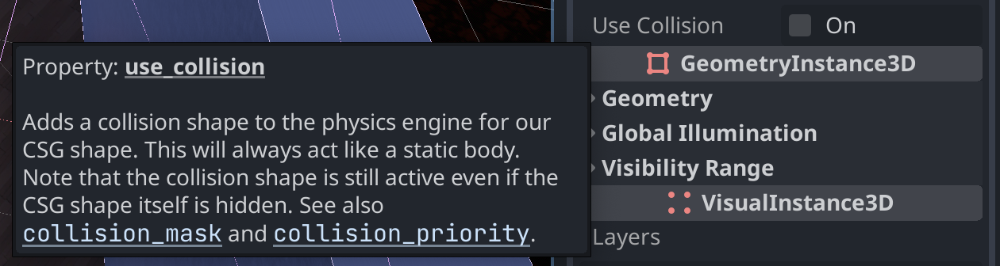

Recently, I published my game, [*Statue Concept*](/project/2023-statue/), on Itch.io and wanted to share my experience using the Godot game engine. In this article, I will discuss some of the thoughts and issues I encountered while working with Godot, along with the workarounds I found. Hopefully, this will be helpful for others who are considering using Godot for their game development projects.

I intend to write more of these, if/when I publish more of these projects. So maybe look forward to a "My Experience Using Godot Part 2" in the future.

> **Note**: This is the first time I've used Godot for a project of this scale, so I am still learning. I'm sure I've missed a few obvious things that would have made my life easier. Feel free contact me if you have any suggestions or corrections 😊.



## Issue 1 - Referencing scene objects from C# can be flaky
One issue I faced while using Godot with C# was a mild difficulty with referencing other scene objects from C# code. The `GetNode<Node3D>("path/to/object")` method can easily break if objects are moved around in the scene, causing it to silently return null instead of the desired object.

By itself, that's not much of a problem. But when attempting to use the returned null value, the resulting `NullReferenceException` only shows up on the "Debugger" tab, not the "Output" tab (which is the tab that is visible by default).


{}
*Nothing shows up in the "Output" tab, at a first glance it looks like everything is running as expected.*
{}

If you don't notice the number on the `Debugger (540)` tab going up, you're left to wonder why it looks like your script isn't running at all (or is only running up to a certain point).

For contrast, in GDScript if you reference a node that doesn't exist in code (e.g. `$Does/Not/Exist`), you get a nice error in the output:


{}
*This is much easier to notice than the C# issue.*
{}

In the end, I wrote some code to automatically check these paths in C# to make sure the node referenced in the text actually exists.

I created an AutoLoad scene and script called "SceneTreePathCheck" that uses reflection to check if the referenced nodes actually exist in the scene tree. By simply adding the `[CheckPath]` attribute to the private constant string that holds the path, the code automatically validates the path during runtime and prints a warning to the console if the referenced node doesn't exist. I find this solution much easier to work with compared to the default behavior in C#.

```csharp
public partial class example_object : Node3D
{
    [CheckPath] // This is the only line you need to add.
    private const string path_to_child = "path/to/child";

    public override void _Ready()
    {
        // Use the path as normal.
        my_child = GetNode<Node3D>(path_to_child);
    }
}
```

And the resulting warning in the console:


{}
*Now C# can have the same helpful error message as GDScript.*
{}

I may release this as a plugin in the Godot Asset Library at some point. Assuming this issue isn't already addressed in Godot itself, first.

## Issue 2 - CSG doesn't play nicely with Navigation

> **Note**: This is an issue that is only in version 4.1 of Godot and earlier. It has already been fixed in the master branch of Godot, but not in any released version of Godot yet. It should be fixed in Godot version 4.2 and onward.
>
> This is the associated [GitHub Issue](https://github.com/godotengine/godot/issues/81027) for this bug.

Another issue I encountered was that Godot's navigation code doesn't appear to handle navigating on CSG (Constructive Solid Geometry) meshes.

CSG is a way to make simple 3D models (like rooms and corridors) by combining and subtracting simple shapes (like cubes, spheres, and cylinders). CSG provides a toggle for collision:



But this collision doesn't appear to be recognized when a NavigationMesh's `ParsedGeometryType` is set to `Static Colliders`.

> **Side Note**: You can still combine CSG with a NavigationMesh if you use `Mesh Instances` instead of `Static Colliders`, but this is way less performant. *Statue Concept* rebakes the navmesh constantly in the background during gameplay, so I need the performance.
>
> Theoretically, the navmesh rebaking happens on another thread. Practically, though, it still causes a noticeable stutter in the game when regenerating a navmesh with mesh instances. Cursory investigation suggests that accessing meshes like this can't be done on a separate thread, so it's probably unavoidable.

To address this problem, I created a `[Tool]` called "AutoCollision" that runs in the editor. This tool reads the collision shape from the CSG and uses it to create a `ConcavePolygonShape3D` attached to a static body. This way, the CSG object behaves like any other static body in the scene, allowing the navigation mesh to be regenerated using "Static Colliders" for the parsed geometry type.

> I *would* add this to the Asset Library, but considering the issue is already fixed in the master branch of Godot, there's no need to.

## Issue 3 - There's no built-in way to find a child of a node by type
Admittedly, this is a minor issue, but it's something I would like to have in Godot. In Unity, there's a method called `GetComponentInChildren<T>()` that is very useful for finding a child/children of a node by a given type, but Godot doesn't have any such method. All you can do is search for a child by name, or enumerate all children and check their types manually.

> In *Statue Concept*, this is used to find all lights in a scene without needing to remember to set groups on them.
>
> The lights are crucial to gameplay, they are used to stop the statue from moving, so it's important to always find all of them.

I created an extension method to do this, and it's not too much code:

```csharp
public static class NodeExtensions
{
    public static List<T> FindNodesByType<T>(this Node node) where T : Node
    {
        List<T> output = new();
        FindNodesByType(node, output);
        return output;
    }

    public static void FindNodesByType<T>(this Node node) where T : Node
    {
        List<T> output = new();
        if (node is T)
        {
            output.Add(node as T);
        }

        foreach (Node child in node.GetChildren())
        {
            child.FindNodesByType(output);
        }
    }
}
```

While it's not a lot of code, I think it would be nice if it were built-in.

I may also put this in the Godot Asset Library, too, but I'm not sure. It's a pretty small amount of code.

## Conclusion

Overall, I'm pretty happy with the state of Godot. As far as implementation goes, everything 'feels' coherent and is implemented in a logical way that I feel like I would do if I was in charge of adding a feature to a game engine. For projects of my size (small), it's more than ready to use. I would definitely recommend Godot for personal projects and for beginning to learn game development.

I do occasionally encounter unexplainable errors and issues when modifying scenes, but that's nothing a quick project reload doesn't fix.


{}
*When in doubt...*
{}

However, for someone who's trying to break into the game development industry or trying to build a career, I would be more hesitant to recommend Godot. It's not that I think Godot isn't ready for that (I don't think I can even be a good judge of that at this point), it's just that it's not used *at all* for mainstream game development. I think it's a great engine, but it's hard to recommend for professional projects when nobody else on your team is going to know how to use it.

Maybe that will change in the not-so-distant future 🤔.

