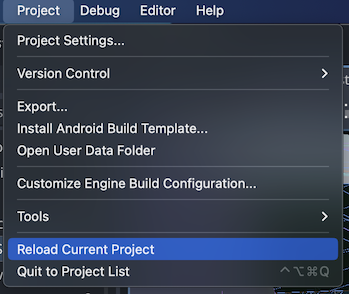

#### Outline
**Intro**: Thoughts and issues I encountered, with ways I worked around them
* Context: Just published *Statue Concept* on Itch.io, and I wanted to have a mini-postmortem of my experience with Godot so far.
* I intend to write more of these, if/when I publish more of these projects.
* Caveat: This is the first bigger-than-tiny project I've used Godot for, I'm still learning. I'm sure I've missed a few obvious things.


**Issue 1**: Referencing scene objects from C# can be flaky
* `GetNode<Node3D>("path/to/object")` can easily be broken if you move objects around in your scene, silently returning null instead of an object.
* When attempting to use the returned null value, the resulting NullReferenceException only shows up on the "Debugger" tab, not the "Output" tab (whch is the tab that is visible by default).
    * You have to notice the error count incrementing in the tab name in the editor: "Debugger (123)". This is easy to miss.
    * 
    * *Nothing shows up in the "Output" tab, at a first glance it looks like everything is running as expected.*
    * If you don't notice the number going up, you're left to wonder why it looks like your script isn't running at all (or is only running up to a certain point).
* For contrast, in GDScript if you reference a node that doesn't exist in code (e.g. `$Does/Not/Exist`), you get a nice error in the output:
    * 
    * *This is much easier to notice than the C# error.*
* In the end, I wrote some code to automatically check these paths in C# to make sure the node referenced in the text actually exists.
* I created an AutoLoad scene and script called "SceneTreePathCheck" that uses reflection to look at the scene tree for any objects that have members with a `CheckPath` attribute.
* Using it is very simple:
```csharp
public partial class example_object : Node3D
{
    [CheckPath] // This is the only line you need to add.
    private const string path_to_child = "path/to/child";

    public override void _Ready()
    {
        // Use the path as normal.
        GetNode<Node3D>(path_to_child);
    }
}
```
* If the path in code doesn't exist in the scene tree, then a warning is printed to the console:
    * 
* I may release this as a plugin in the Godot Asset Library at some point.
    * Assuming this issue isn't already addressed in Godot itself, first.


**Issue 2**: CSG doesn't play nicely with NavigationAgent
* CSG - Constructive Solid Geometry, a way to make simple 3D models (like rooms and corridors) by combining and subtracting simple shapes (like cubes, spheres, and cylinders).
* CSG provides a toggle for collision:
    * 
* But this collision doesn't appear to be recognized when a NavigationMesh's `ParsedGeometryType` is set to `Static Colliders`.
    * This appears to be a known issue: [GitHub Issue](https://github.com/godotengine/godot/issues/81027)
        * And as of writing, already fixed in the master branch! 🎉
        * But not in any released version of Godot yet 😢. It should be available in Godot version 4.2 and onward
* You can still generate a navmesh if you use `Mesh Instances` instead of `Static Colliders`, but this is way less performant.
    * *Statue Concept* rebakes the navmesh constantly during gameplay, so I need the performance.
* The work around I engineered was to create a `[Tool]` (called AutoCollision) that runs in the editor.
    * It reads the collision shape from the CSG (`csgMesh.CreateTrimeshShape();`) and puts that data into a `ConcavePolygonShape3D` attached to a static body.
* This way, it's no different than any other static body in the scene, and the navmesh can quickly be regenerated using `Static Colliders` for the parsed geometry type.


**Issue 3**: There's no way to find a child of a node by type.
* Unity has `GetComponentInChildren<T>()`, which is very useful, and something I would also like to have in Godot.
* Easily solved with an extension method and not too much code:
```csharp
    public static class NodeExtensions
    {
        public static List<T> FindNodesByType<T>(this Node node) where T : Node
        {
            FindNodesByType(node, output);
            return output;
        }

        public static void FindNodesByType<T>(this Node node) where T : Node
        {
            List<T> output = new();
            if (node is T)
            {
                output.Add(node as T);
            }

            foreach (Node child in node.GetChildren())
            {
                child.FindNodesByType(output);
            }
        }
    }
```
* Would be nice if it were built-in, though.
* I may also put this in the Godot Asset Library, too, but I'm not sure. It's a pretty small amount of code.

**Conclusion**
* Overall, I'm pretty happy with the state of Godot.
* I do occasionally encounter unexplainable errors and issues when modifying scenes. But that's nothing a quick project reload can't fix.
    * 
    * *When in doubt...*
* But overall, I would recommend Godot for personal projects and such.
* It's harder to recommend for professional projects, but mainly because there's not much experience with it in the industry yet.
    * Maybe that will change in the future 🤔.