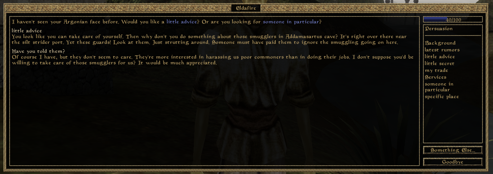
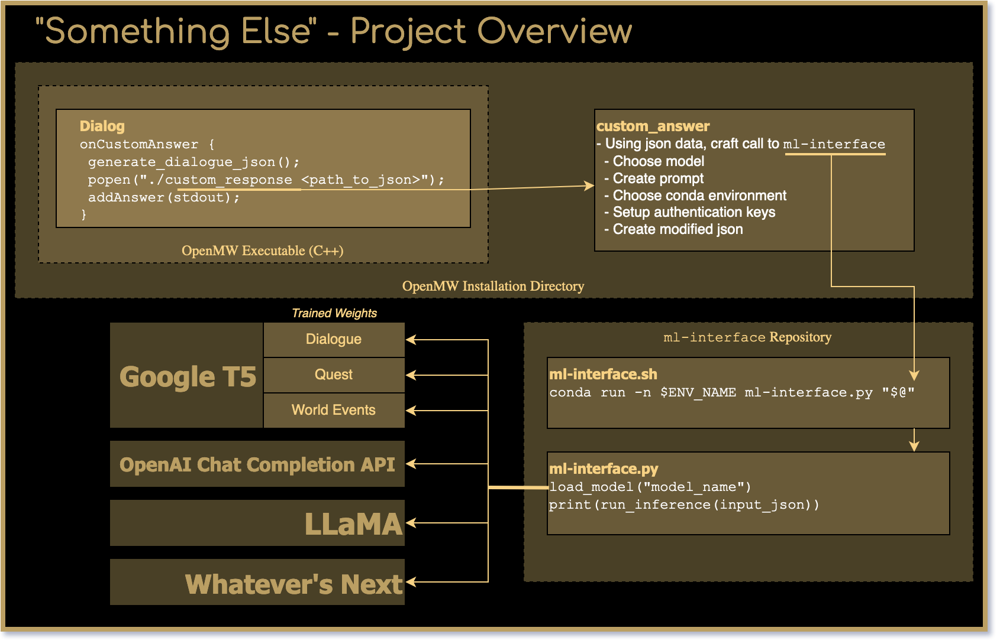
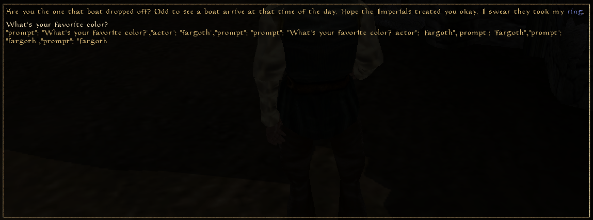
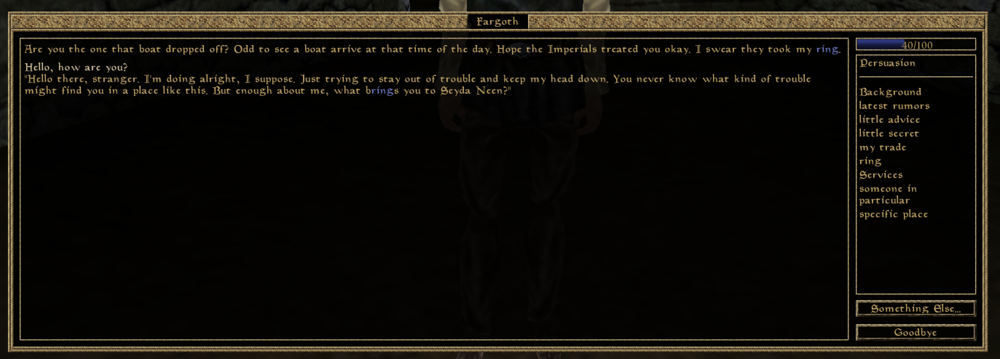
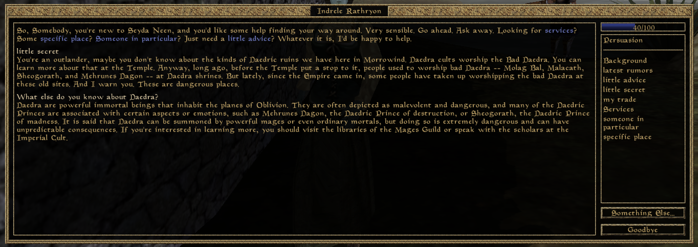
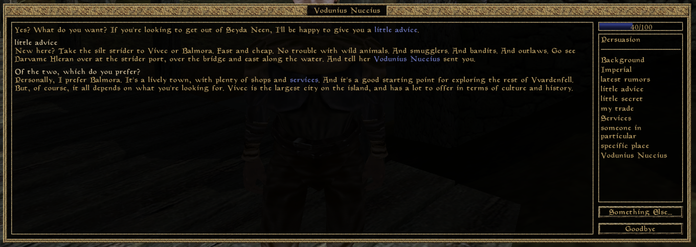
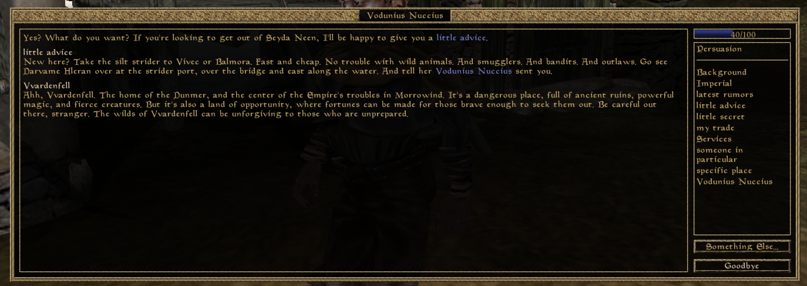

Something Else is a source-level mod that adds machine-generated text to [OpenMW](https://openmw.org/en/), an open-source reimplementation of the game engine from [The Elder Scrolls III: Morrowind](https://elderscrolls.bethesda.net/en/morrowind).

The name comes from a new button added to the dialogue window that allows you to enter a custom line of dialogue to speak to an NPC.



# Info

{}
The button
{}

{}
Screenshot of generated dialogue  
*(using OpenAI's GPT Chat Completion API)*
{}

* **Status**: Active Development
* **State** *(As of 2023-05-01)*: In early development. Dialogue generation in conversations is functional, but there's nothing implemented outside of that. (No disposition changes for being rude/nice, no dynamic quest generations, no memory of conversations, etc.)
* **Download**: Not currently easily installable. See [installation instructions](https://github.com/Netruk44/ml-interface/blob/main/doc/openmw-install.md) for detailed instructions. 
* **Source**:
  * **GitHub:**[Netruk44/ml-interface](https://github.com/Netruk44/ml-interface)
    * Python and shell scripts that interface with various model backends to generate text.
    * Currently holds the logic to transform the context json into the dialogue format that ChatGPT works with.
  * **GitLab:**[Netruk44/OpenMW @ `something-else-mod`](https://gitlab.com/Netruk44/openmw/-/tree/something-else-mod?ref_type=heads)
    * Modifications to the dialogue window to allow custom text input.
    * Creation of context json object that gets sent to the ml-interface scripts.
  * **GitHub:**[Netruk44/nixpkgs @ `openmw-ipc-mod`](https://github.com/Netruk44/nixpkgs/tree/openmw-ipc-mod)
    * The 'build system' for the mod.
    * Packages everything into a runnable executable.
    * Package name: `openmw-mod-something-else`

> **Note**: See [How it works](#how-it-works) for more info about the individual pieces.

* **Technologies & Languages**: C++, Python, Nix, Google T5, OpenAI API

## Description
The starting point for "Something Else" is as a conversation mod for Morrowind. You enter in a custom line of text you would like to say to the NPC, and a machine-generated response is created for you. Wouldn't it be nice if you could say something outside of a small list of predefined in-game topics? The goal is to have a mod that allows you to do just that.

The mod is intended to have settings so that you can choose to either run the text generation on the local machine, or use an API like OpenAI's to generate the text remotely.

I have plans to experiment with training a number of small text models (such as [Google's t5-small](https://huggingface.co/t5-small)) for different specific tasks that should be able to run on CPU-only within a relatively short amount of time (hopefully under 5 seconds). The idea is that a number of smaller models trained for specific tasks will be able to run on general hardware, as opposed to a single large model like GPT or LLaMA which requires a lot of GPU power.

> And, (in the case of LLaMA) it would also be nice if I could redistribute the weights, too 😊

With that in mind, the end goal for the mod is to (eventually) be a little bit more than just AI generated dialogue responses. Backing the mod is a framework that should allow the game to be extended in a few different ways. A few ideas I have in mind are:

* Giving memory to NPCs, so that they can remember things you've told them and bring it up next time you initiate conversation with them.
  * Or maybe they might even seek *you* out next time you're in town.
* Adding dynamically generated quests to the game.
  * Basically Radiant Quests, but hopefully with more variety.
* Add custom escort logic to NPCs.
  * Need to know where that stupid cave is? Ask the quest giver to escort you there.
  * (I will admit to this being a far-fetched idea, though. I don't even know if the engine supports this kind of navigation from NPCs.)
* Actual real-(game-)world reactions to your roleplaying
  * If you're a notorious thief, a shopkeeper might call the guards on you just to keep you out of their store.
  * A trainer may provide you their services for free if you can convince them it'll be worth their time.
  * Instead of just clicking "Taunt", "Bribe" and "Intimidate" buttons, you can roleplay your way through the conversation instead.
  * Beg for money on the streets, if you're desperate enough. Maybe someone will give you a gold or two.

# How it works

Here's a diagram that gives a high-level abstracted overview of how the mod works:

# Screenshots

{}
**2023-03-27**  
Screenshot of first ever generated dialogue using t5-small.  
*(It's obviously not very good, since the model has undergone no fine-tuning whatsoever.*  
*The model mostly just regurgitates the input json.)*
{}

{}
**2023-03-28**  
Screenshot of first generated dialogue using OpenAI's GPT Chat Completion API.  
*(With the expected vastly improved results compared to un-finetuned T5-small)*
{}

{}
Screenshot of first generated dialogue with the model aware of dialogue history, notice how the model matches the length of the message that comes before it.  
*(Using OpenAI's GPT Chat Completion API)*
{}

{}
Screenshot of generated dialogue with the model aware of dialogue history, referencing the contents of a message that came before.  
*(Using OpenAI's GPT Chat Completion API)*
{}

{}
Come up with your own custom topics if the list doesn't cover what you're looking for.  
*(Using OpenAI's GPT Chat Completion API)*
{}

{}
**2023-04-23**  
Giving some additional context to the model, such as disposition, what faction the NPC is in, what race the player is, their name, etc.  
*(Using OpenAI's GPT Chat Completion API)*
{}
