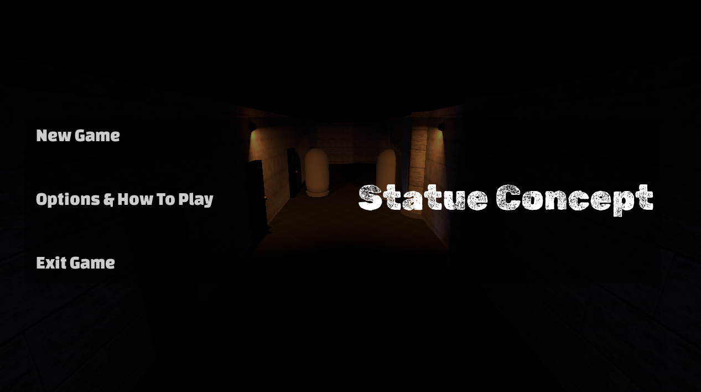
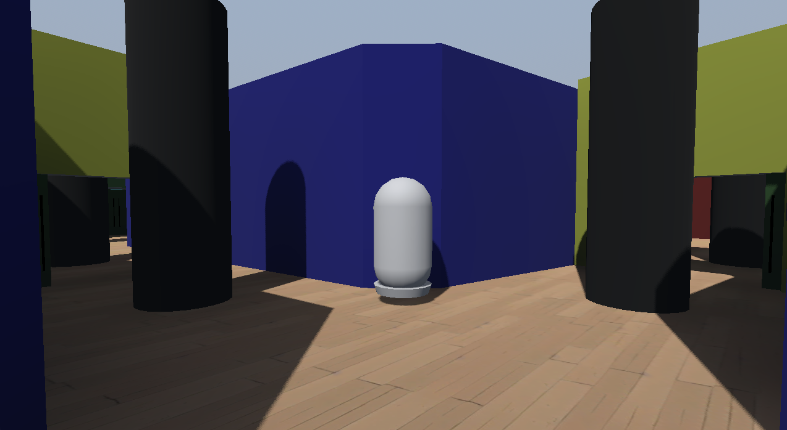
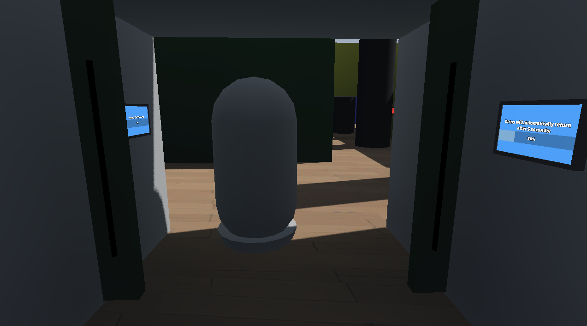
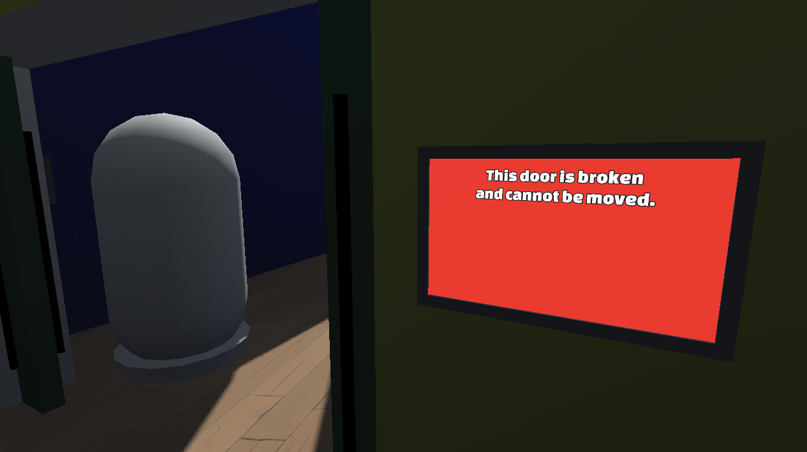
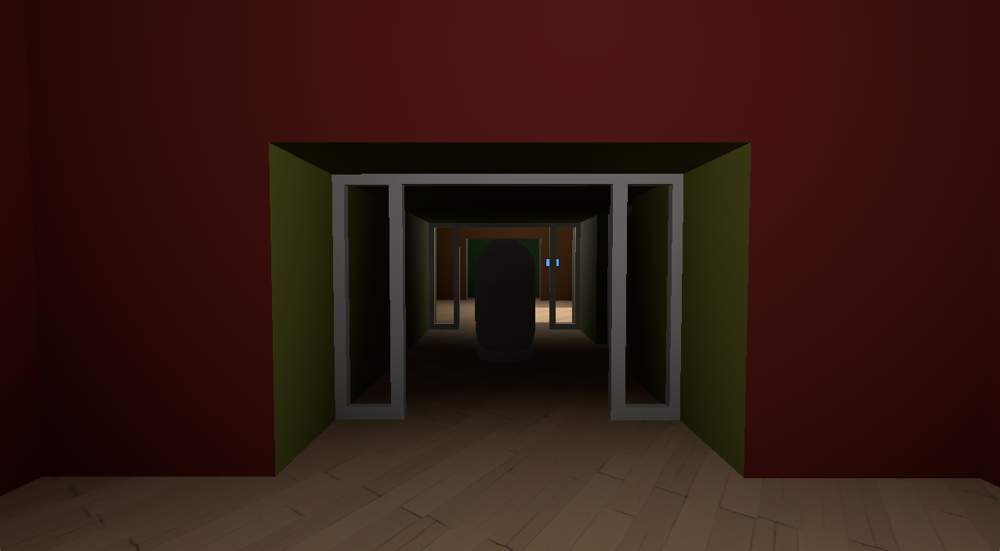
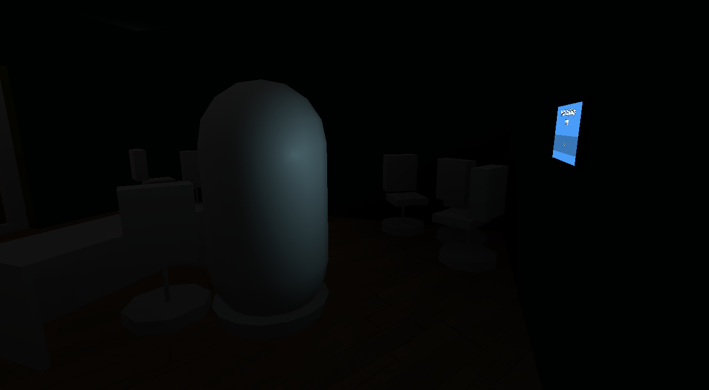
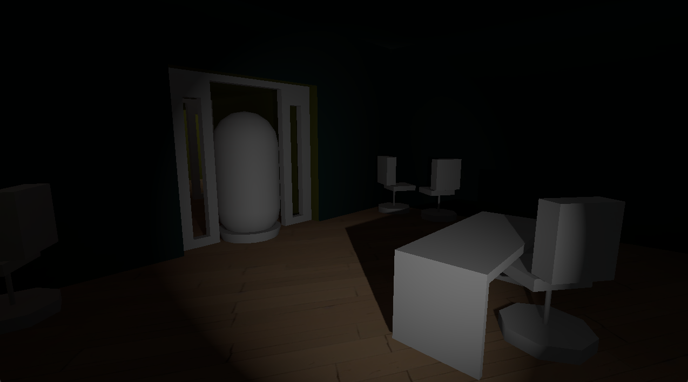

<!-- TODO: Update screenshots when the game is released -->

A horror video game concept made in the Godot engine. Try to navigate rooms and solve puzzles while being pursued by a statue that can only move when you aren't looking at it.

{}
**Title Screen**
{}

# Info
* **Status**: In development
* **Screenshots**: On ~~Itch.io~~ or available [below](#screenshots)
* **Download**: ~~Itch.io~~ *(Pending)*<!--[Itch.io](https://netruk44.itch.io/statue-concept)-->
* **Source**: ~~GitHub~~ *(Pending)*<!--[Github](https://github.com/Netruk44/statue-concept)-->
* **Technologies & Languages**: Godot, C#

## Related Posts and Projects
* **Blog Post**: [Tutorial: Weeping Angel Effect in Godot Engine](/post/godot-weeping-angel-effect)
* **Blog Post**: [Tutorial: 3D Navigation in Godot](/post/godot-navigation)

## Why?
From the *Weeping Angel Effect in Godot Engine* blog post:
> One of the things I normally do when messing around with a game engine is try to recreate one aspect of a game I helped make in college, [Stonewick Manor](https://old.danieltperry.me/stonewick.html).

I figured I might as well release what I've made so far as a small game concept to the public.

# Screenshots
> **Note**: These screenshots may be out of date. Check the Itch.io page above for the most recent screenshots.



