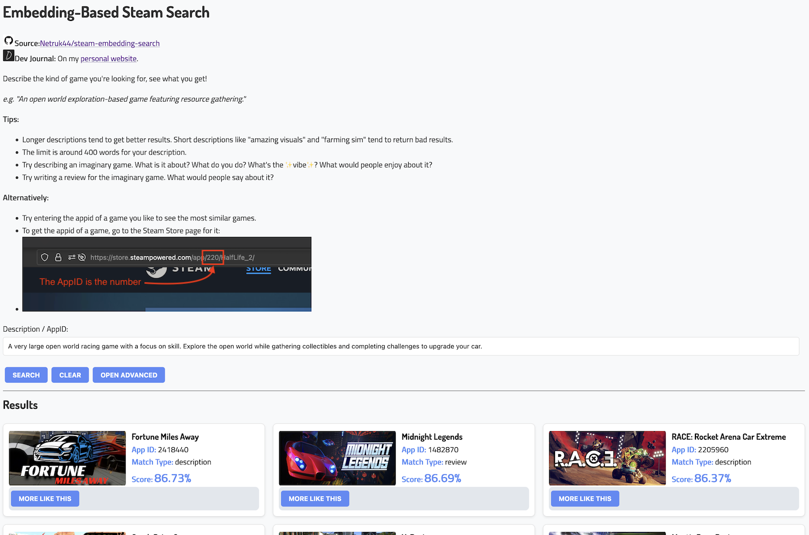

{}
**[Steam Embedding Search](https://storage.danieltperry.me/share/steamvibes/build/)**
{}



# Info
* **Status**: Released
* **Source**: [GitHub](https://github.com/Netruk44/steam-embedding-search)
* **View**: [Website](https://storage.danieltperry.me/share/steamvibes/build/)
* **Technologies & Languages**: Python, Docker, React, Sqlite3
* **Machine Learning Models and Libraries**: [Instructor-XL](https://huggingface.co/hkunlp/instructor-xl), [Hnswlib](https://github.com/nmslib/hnswlib)

## Related Posts and Projects
* **Dev Journal**: [Embedding-Based Steam Search](/post/instructor-as-search-engine/)
* **Related Previous Project**: [Repo Search](/project/2023-repo-search/)

## Why?
I thought that a 'describe a game and see what matches best' search engine would be a fun idea to try making, bringing together a bunch of different skills. Starting with Python data gathering and processing, to machine learning, to web development, and finally writing about how it was all done.

In the future, I'd also like to apply this same concept to the Itch.io store (if that's not already in the list of related projects above).