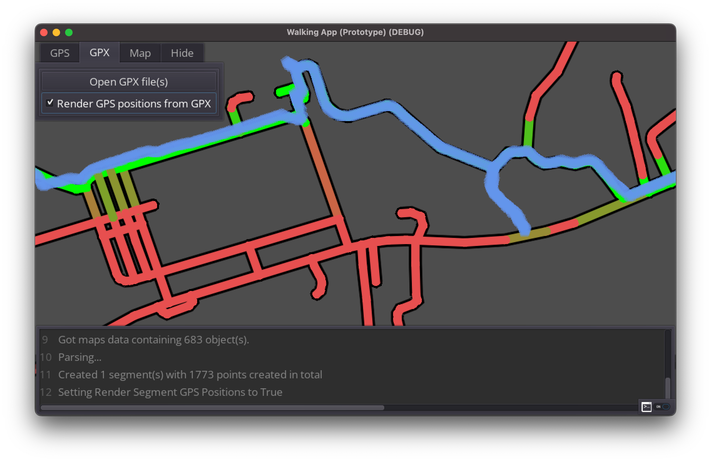
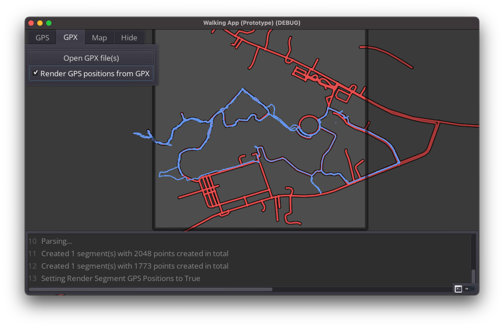
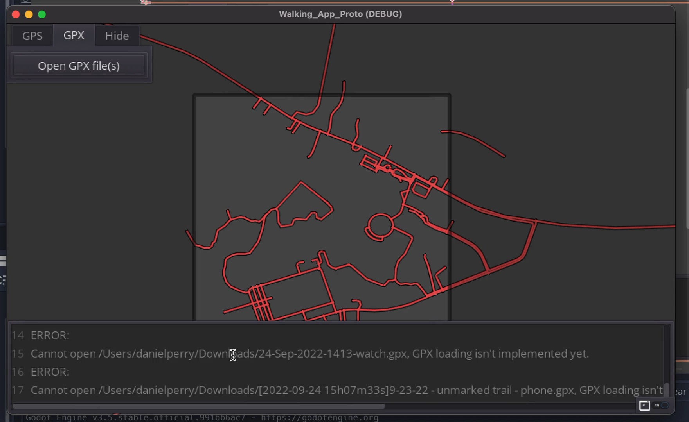
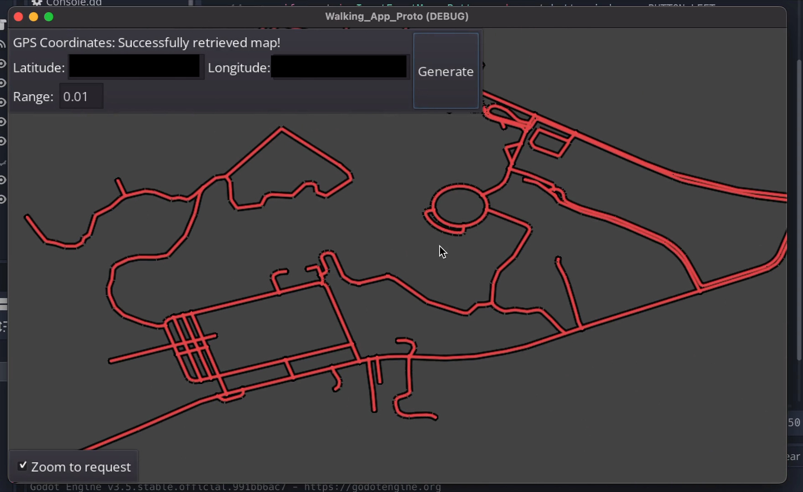
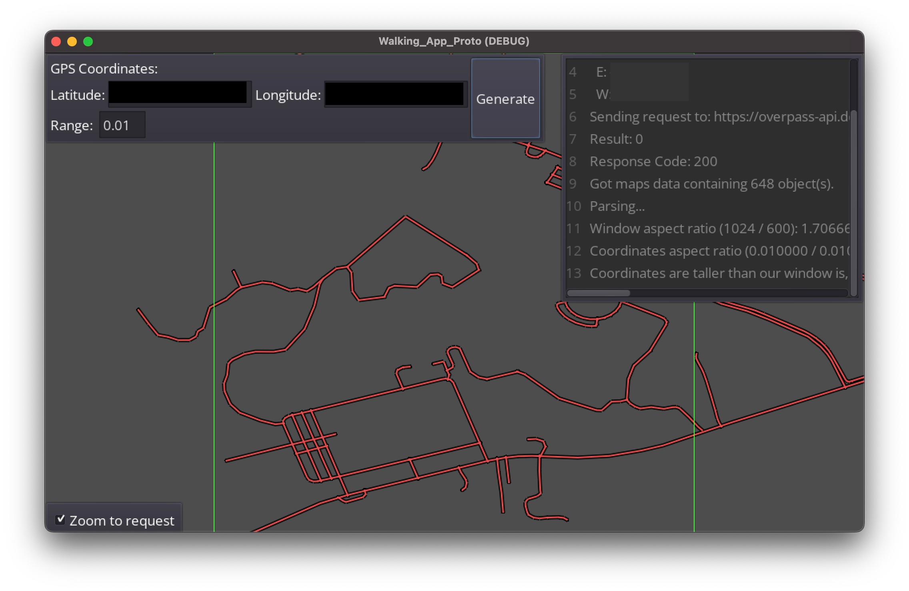
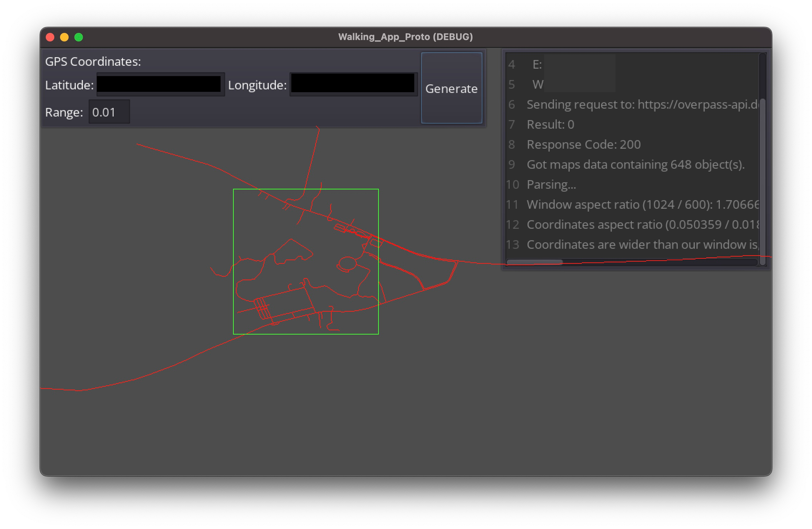

An application intended to help you thoroughly explore an area of the map. Pick an area of the world map with roads or paths that you'd like to explore every part of. Then, import GPX files tracking previous excursions through that area, and try to 'fill out' the entire map by visiting every point.

As a stretch goal, the program will encourage re-exploration of an area by gradually fading away explored areas as time goes on. This way, you can re-explore the same areas multiple times, possibly revisiting the same routes from different angles.

# Info

{}
**Icon**  
*Generated with [Stable Diffusion](https://github.com/CompVis/stable-diffusion) using [InvokeAI](https://github.com/invoke-ai/InvokeAI)*'s web UI.
{}

{}
**Screenshot**
{}

* **Status**: In Development
* **Download/Source**: *Pending*
* **Technologies & Languages**: Godot, GDScript
* **APIs & Resources**: OSM Overpass, Azure [Virtual Machine for self-hosted Overpass server]

# Why
An app I wanted to make for myself. I've wanted a tool to track my progress in exploring certain areas of the globe, such as making sure I go down every path in a park or nature area. Usually, my outings to places like these are sporadic, and it might be a long time between visits of any individual place.

I think it could be useful to have a tool I could use to see where I've been in any particular park so that I can plan a route in the same place, while making sure it still feels fresh.

# Inspiration
I took inspiration from how the map works in open world driving video games like: *Forza Horizon*, *The Crew*, and *Test Drive Unlimited*.

{}
*Notice how the road varies in color between 'discovered' and 'undiscovered' roads in* Forza Motorsport.
{}

# Goals
* Learn Godot
    * I have some game ideas I want to work on in the future.
    * I have prior experience with Unity, but Godot seems to be getting more popular as of late.
    * I have some time to dedicate to learning a new game engine.
* Get familiar with some OpenStreetMaps APIs
    * One particular game idea I have in mind would heavily use OSM data for game world generation.
    * I'd like to have an bigger project I contribute to while working on my own personal project(s).
    * Maybe the app could be used to help fill out the OSM database in some way?

# Development Journal

## Early versions

#### v0.6
*10/02/22*
* Map implementation overhaul (for per-segment color control)
* GPX-Map intersection (Using Godot builtin 2D Physics library)

#### v0.5
*10/01/22*
* Reading GPX file implemented (Using Godot builtin [XML Parser](https://docs.godotengine.org/en/3.6/classes/class_xmlparser.html))

#### v0.4
*9/27/22*
* UI overhaul

#### v0.3
*9/26/22*
* Camera zoom and scrolling implementation (Godot builtin 2D Camera)

#### v0.2
*9/25/22*
* Better line drawing (using [antialiased line2d](https://github.com/godot-extended-libraries/godot-antialiased-line2d) from the Godot Asset library.)

#### v0.1
*9/25/22*
* OSM Overpass API implementation (using Godot builtin [Http Request](https://docs.godotengine.org/en/3.6/tutorials/networking/http_request_class.html))

